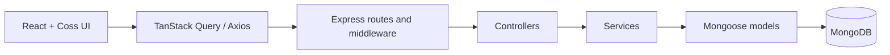

# Roadly

Customer Feedback + Feature Request + Public Product Roadmap SaaS, built for **Technical Assessment Project 01**.

Roadly gives users a place to submit ideas, vote, discuss, and follow delivery progress. Product teams use the same requests to moderate discussion, prioritize work, and publish a clear roadmap.

[Repository](https://github.com/durgeshpatel-dev/com.bot-Roadly) · [API reference](docs/05-API-SPECIFICATION.md) · [Deployment](docs/13-DEPLOYMENT.md) · [Requirements and evidence](docs/20-REQUIREMENT-TRACEABILITY.md) · [Release report](docs/21-RELEASE-REPORT.md)

## Features

- Authenticated feature submission with title, Markdown, categories, and validation; public feed and detail pages.
- Server-side title/description text search with 300 ms debounce, category/status filters, pagination, and Newest / Most Upvoted / Most Discussed sorting.
- Atomic, idempotent upvote/unvote with MongoDB `$addToSet`, `$pull`, `$inc`; optimistic UI and failure rollback.
- Markdown root comments and direct replies, author/admin moderation, soft deletion, and active comment counts.
- Admin RBAC and adjacent lifecycle transitions: Under Review ↔ Planned ↔ In Progress ↔ Completed.
- Public three-column roadmap: Planned, In Progress, Completed.
- Signup, email verification simulation, login, refresh rotation/reuse detection, logout, and password recovery.
- Responsive Coss UI with loading/empty/error states, toasts, and Light/Dark/System themes.
- Approved additions: paginated request activity and admin insights (totals, lifecycle counts, and top requests).

“Most Upvoted / Trending” sends `sort=most-voted`; no separate trending algorithm is claimed.

## Architecture and security



Backend authorization loads the current user from MongoDB; client-supplied roles are never trusted. Passwords use bcrypt with cost 12. Access JWTs expire in **15 minutes** and remain in memory. Refresh JWTs expire in **7 days** and live in a scoped **httpOnly cookie**. Refresh rotates the token hash atomically; replay revokes stored sessions. Password reset increments an authentication version so older access and refresh tokens are rejected.

Verification/reset tokens are random, hashed in storage, expiring, and single use. Production enables secure cookies and requires HTTPS client origins. Input validation, controlled query construction, response projections, Helmet, origin checks, and rate limiting protect the API. Public responses omit password hashes, token/session fields, private user email, and raw voter arrays. Auth endpoints intentionally return the access token to the authenticated client. User Markdown does not execute raw HTML.

MongoDB has five models: **User**, **RefreshToken**, **Post**, **Comment**, and **Activity**. Votes use an embedded set and denormalized count. Comments use a two-level adjacency list; deleted content renders `[deleted]`. The [database guide](docs/04-DATABASE-DESIGN.md) explains relationships and every retained index.

## Stack and third-party dependencies

| Libraries/tools | Why used |
|---|---|
| React, React DOM, React Router | Component UI, browser rendering, nested routes and guards |
| TypeScript, Vite, React Vite plugin | Type checks, development server, optimized static build |
| Coss UI, `@base-ui/react` | Assessment-required source-owned, accessible primitives |
| Tailwind CSS v4, `@tailwindcss/vite` | Shared tokens and responsive utility styling |
| TanStack Query | Server cache, invalidation, optimistic voting |
| Axios | API calls, credentials, coordinated token refresh |
| React Hook Form, Zod, `@hookform/resolvers` | Forms and typed validation |
| react-markdown | Safe Markdown rendering without executing raw HTML |
| Lucide React, Fontsource Inter | Icons and locally bundled typography |
| clsx, tailwind-merge, class-variance-authority | Coss class composition and variants |
| `@daypicker/react`, date-fns | Retained reusable Coss calendar primitive; no calendar product feature |
| Express, Mongoose | Layered REST API and MongoDB schemas/queries |
| bcryptjs, jsonwebtoken | Password hashing and signed JWTs |
| cookie-parser, cors, helmet, express-rate-limit | Cookie parsing, allowed origins, headers, abuse controls |
| dotenv | Local server configuration |
| Vitest, Supertest, mongodb-memory-server | API/security/concurrency tests with isolated real MongoDB processes |
| Testing Library, jest-dom, jsdom | Browser-like component, hook, and accessibility-semantic tests |
| Oxlint, tsx, concurrently, `@types/*` | Lint, server development, workspace startup, library typings |

No external email, analytics, notification, or AI service is required for the local demo. MongoDB is the only runtime data service. npm manifests and the lockfile are the dependency source of truth.

## Local setup

Use **Node.js 24.x** (see `.node-version`) and its npm. A local MongoDB instance or a provisioned MongoDB connection is required for the running application. Tests start their own isolated MongoDB instance.

```sh
git clone https://github.com/durgeshpatel-dev/com.bot-Roadly.git
cd com.bot-Roadly
npm ci
```

Copy `server/.env.example` to `server/.env` and `client/.env.example` to `client/.env`. In PowerShell:

```powershell
Copy-Item server/.env.example server/.env
Copy-Item client/.env.example client/.env
```

Generate two distinct secrets locally, one per command invocation:

```sh
node -e "console.log(require('node:crypto').randomBytes(48).toString('hex'))"
```

Paste them into the ignored server environment file. Do not commit or share the output.

| Server variable | Purpose |
|---|---|
| `NODE_ENV` | `development`, `test`, or `production` |
| `PORT` | API port; default `5000` |
| `MONGODB_URI` | e.g. `mongodb://127.0.0.1:27017/roadly` |
| `JWT_SECRET` | Access signing secret, at least 32 characters |
| `JWT_REFRESH_SECRET` | Different refresh signing secret, at least 32 characters |
| `CLIENT_URL` | Exact browser origin, e.g. `http://localhost:5173`; no trailing slash/path |
| `COOKIE_SAME_SITE` | `strict` default; `lax` or production-only `none` where needed |
| `TRUST_PROXY` | Trusted proxy hop count; `0` locally |
| `ADMIN_EMAIL`, `ADMIN_PASSWORD`, `ADMIN_NAME` | Used only by the operator-run admin seed |

Client `VITE_API_URL` is public build-time configuration, e.g. `http://localhost:5000/api`. Never put a secret in a `VITE_` variable. Workspace commands load the server/client env files in their own directories; the root example is a reference, not a substitute.

Start MongoDB, then:

```sh
npm run dev
```

Open `http://localhost:5173`; API health is `http://localhost:5000/api/health`. The application creates collections and declared indexes through Mongoose. See [database/index operations](docs/04-DATABASE-DESIGN.md) before upgrading an existing database.

Development verification and reset links appear in the private server terminal. Open those links to complete the flows. These links are sensitive and must not be recorded or published. Unverified accounts may log in; verification still changes account state.

### Admin account

Set local admin values in `server/.env`, then run:

```sh
npm run seed:admin -w server
```

The seed creates a verified admin, leaves an existing admin unchanged, and refuses to promote an existing regular account. It does not overwrite passwords. Remove temporary seed credentials from the environment after use. There is no public role-promotion endpoint or committed demo password.

## API overview

All routes use `/api`, JSON envelopes, and Bearer access tokens for protected operations. Cookie-based auth calls send credentials.

| Family | Implemented routes |
|---|---|
| Auth | `POST /auth/register`, `/verify-email`, `/login`, `/refresh`, `/logout`, `/forgot-password`, `/reset-password` |
| Current user | `GET /users/me` |
| Requests | `GET/POST /posts`; `GET/PUT/DELETE /posts/:id` |
| Voting | `POST/DELETE /posts/:id/vote` |
| Comments | `GET/POST /posts/:postId/comments`; `PUT/DELETE /comments/:id` |
| Roadmap | `GET /roadmap` |
| Activity | `GET /posts/:id/activity` |
| Admin | `GET /admin/posts`, `PATCH /admin/posts/:id/status`, `GET /admin/stats` |
| Health | `GET /health` |

Example feed:

```text
GET /api/posts?page=1&limit=10&sort=most-voted&category=ui-ux,performance&status=planned,in-progress&search=dashboard
```

[API documentation](docs/05-API-SPECIFICATION.md) defines requests, response shapes, authentication, errors, and pagination for each endpoint.

## Tests and builds

Run from the repository root:

```sh
npm run check
```

Individual checks:

```sh
npm test
npm run test -w server
npm run test -w client
npm run typecheck
npm run lint
npm run build
npm audit
```

The server build emits `server/dist`; production starts with `npm start -w server`. The frontend emits `client/dist`. First-time tests may download a MongoDB binary; they do not use the configured application database. CI runs installation, checks, and dependency audit on Node 24. Actual release test counts, bundle measurements, browser QA, warnings, and repository state are recorded in [release evidence](docs/21-RELEASE-REPORT.md).

## Deployment

[Deployment runbook](docs/13-DEPLOYMENT.md) covers native Node or the provided backend Dockerfile, static frontend hosting, MongoDB, indexes, HTTPS/CORS/cookies, seed setup, health checks, and smoke tests. `client/vercel.json` supplies SPA routing and security headers. These files prepare deployment; they do not prove a hosted service is live.

**Production email is a remaining integration step:** simulation is disabled in production to avoid leaking tokens to logs. Connect a private delivery provider before enabling public signup/recovery. No live deployment or video URL is fabricated.

## Structure

```text
client/src/    Pages, Coss components, hooks, API adapters, contexts, tests
server/src/    Routes → controllers → services → models; middleware/config/seeds
server/tests/ Integration and security regressions
docs/         Requirements, architecture, API, deployment, demo, release evidence
reference/    Original assessment PDFs
```

See [full structure](docs/09-FOLDER-STRUCTURE.md), [decision log](docs/17-DECISION-LOG.md), and [demo/interview plan](docs/15-DEMO-VIDEO-PLAN.md).

## Assumptions and limitations

- Single application/workspace with user/admin roles; not a multi-tenant billing product.
- Email is simulated only in development; no public account recovery delivery without integration.
- Unverified users may log in. Password reset revokes old credentials; ordinary logout revokes its refresh session while access JWTs remain short-lived.
- Embedded voters, offset pagination, unpaginated roadmap, and all replies for a visible root target assessment-scale data.
- MongoDB standalone cross-document updates are not a general transaction boundary; process failures can require counter/reference reconciliation.
- Activity recording is best-effort, not a complete compliance audit log. Insights are snapshots, not historical analytics.
- No WebSockets, follows, notifications, profile pages, true trending algorithm, or unapproved extras.
- Hosting credentials, public video recording/upload, and final candidate submission remain operator/candidate responsibilities unless separately completed and verified.

All 73 mandatory assessment requirements, including universal security/UI requirements and external deliverables, are tracked honestly in the [traceability matrix](docs/20-REQUIREMENT-TRACEABILITY.md).
