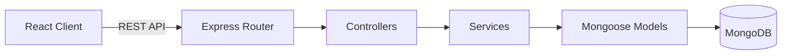

<div align="center">

# 🚀 Roadly

**Customer Feedback • Feature Requests • Public Product Roadmap**

[](#)
[](#)
[](#)
[](#)

</div>

## ✨ Overview
Roadly is a modern, transparent platform designed for product teams to capture user ideas, prioritize workloads, and publish a clear product roadmap. It gives your community a voice and your team the insights needed to build what matters.

## 🎯 Problem Statement
Product feedback is often scattered across emails, support tickets, and social media. Roadly centralizes feedback into a single source of truth where users can submit, discuss, and upvote ideas, while admins transition those ideas into a transparent, public roadmap.

## 💡 Key Features

### 🗣️ User Feedback & Voting
- **Feature Requests**: Submit ideas with rich Markdown descriptions and categorize them (UI/UX, Integrations, Performance, General).
- **Atomic Voting**: Optimistic UI for instant upvote/unvote interactions with database-level safety to prevent duplicate votes.
- **Threaded Discussions**: Participate in multi-level threaded conversations on any feature request.

### 🔍 Discovery & Organization
- **Dynamic Feed**: Sort requests by newest, most voted, or most discussed.
- **Instant Search**: Find requests instantly with debounced, server-side text search.
- **Filters**: Quickly filter the feed by category and workflow status.

### 🗺️ Public Roadmap & Activity
- **3-Column Roadmap**: Public, interactive view of items *Planned*, *In Progress*, and *Completed*. (*Under Review* items remain internal).
- **Activity Timeline**: Public logs of status changes and administrative milestones.

### 🛡️ Admin Workflow
- **Role-Based Access**: Dedicated admin workflows separate from standard users.
- **Status Lifecycle**: Manage features through a strict transition pipeline (`Under Review` → `Planned` → `In Progress` → `Completed`).
- **Insights Dashboard**: Admin analytics showcasing totals, lifecycle counts, and top requests.

## 🛠️ Technology Stack

| Category | Technologies |
| :--- | :--- |
| **Frontend** | React, TypeScript, Vite, Tailwind CSS, TanStack Query, React Hook Form, Axios, Coss UI |
| **Backend** | Node.js, Express.js, TypeScript, Mongoose |
| **Database** | MongoDB |
| **Auth & Security**| JWT (Access & Refresh), bcrypt, CORS, Rate Limiting, Helmet |
| **Testing** | Supertest, Vitest (79 Backend Tests / 44 Frontend Tests passing) |

## 🏗️ Architecture
The application uses a separated client-server architecture:


*This layered approach ensures that routing, business logic, and data access remain decoupled, making the backend highly testable and maintainable.*

## 🗄️ Database Structure

> [!NOTE]
> MongoDB is managed via Mongoose schemas with strictly enforced types and indexing.

- **`User`**: Stores credentials (bcrypt hashed) and profile information.
- **`Post`**: Represents a feature request. Contains an embedded array of voter IDs for atomic `$addToSet` / `$pull` operations.
- **`Comment`**: Two-level adjacency list for threaded discussions linked to a `Post`.
- **`Activity`**: Tracks lifecycle status changes of a `Post`.
- **`RefreshToken`**: Manages secure session persistence and token rotation.

## 🔌 API Overview

### Authentication & Users
| Method | Endpoint | Purpose | Access |
| :--- | :--- | :--- | :--- |
| `POST` | `/api/auth/register` | Register a new account | Public |
| `POST` | `/api/auth/login` | Authenticate and issue tokens | Public |
| `POST` | `/api/auth/refresh` | Rotate access/refresh tokens | Public |
| `GET`  | `/api/users/me` | Fetch current user profile | Auth |

### Feature Requests (Posts)
| Method | Endpoint | Purpose | Access |
| :--- | :--- | :--- | :--- |
| `GET`  | `/api/posts` | Fetch paginated, filtered feed | Public |
| `POST` | `/api/posts` | Create a new request | Auth |
| `GET`  | `/api/posts/:id` | Get specific request details | Public |
| `POST` | `/api/posts/:id/vote`| Upvote a request | Auth |
| `DELETE`| `/api/posts/:id/vote`| Remove upvote from request | Auth |

### Comments & Discussions
| Method | Endpoint | Purpose | Access |
| :--- | :--- | :--- | :--- |
| `GET`  | `/api/posts/:postId/comments` | Fetch comments for a post | Public |
| `POST` | `/api/posts/:postId/comments` | Add a comment/reply | Auth |
| `PUT`  | `/api/comments/:id` | Edit own comment | Auth |
| `DELETE`| `/api/comments/:id`| Soft delete comment | Auth/Admin |

### Roadmap & Admin
| Method | Endpoint | Purpose | Access |
| :--- | :--- | :--- | :--- |
| `GET`  | `/api/roadmap` | Fetch the 3-column roadmap | Public |
| `GET`  | `/api/admin/posts` | Fetch paginated admin feed | Admin |
| `PATCH`| `/api/admin/posts/:id/status`| Progress request status | Admin |
| `GET`  | `/api/admin/stats` | Get admin dashboard analytics | Admin |
| `GET`  | `/api/posts/:id/activity` | Fetch activity timeline | Public |

## 🔐 Authentication & Security

> [!CAUTION]
> **Never commit passwords, API keys, access tokens, database credentials, JWT secrets, or `.env` files to version control.**

Roadly employs a robust security model:
- **Stateless Access**: Short-lived JWT access tokens kept in memory on the client.
- **Secure Sessions**: Long-lived refresh tokens securely stored in `httpOnly` cookies.
- **Token Rotation**: Atomic hash rotation on refresh to detect token reuse/replay.
- **Data Protection**: `bcrypt` password hashing (cost 12), request validation via Zod, rate limiting, CORS configuration, and safe Markdown rendering (no raw HTML execution).
- **Access Control**: Strict Server-Side Role-Based Access Control (RBAC) ensuring client roles are never trusted.

## 🚀 How to Run Locally

### 1. Install Dependencies
```bash
git clone https://github.com/durgeshpatel-dev/com.bot-Roadly.git
cd com.bot-Roadly
npm ci
```

### 2. Configure Environment Variables
You must set up environment files for both the server and the client.
```bash
# Server configuration
cp server/.env.example server/.env

# Client configuration
cp client/.env.example client/.env
```
*(Windows PowerShell: use `Copy-Item` instead of `cp`)*

Open the `.env` files and provide your local credentials. Ensure `JWT_SECRET` and `JWT_REFRESH_SECRET` are long, secure random strings.

### 3. Database Setup
A running MongoDB instance is required. Update the `MONGODB_URI` in `server/.env` to point to your local or cloud database (e.g., `mongodb://127.0.0.1:27017/roadly`).

### 4. Start the Application
Start both the frontend and backend concurrently from the root directory:
```bash
npm run dev
```
- Client runs at: `http://localhost:5173`
- API runs at: `http://localhost:5000/api`

### 5. Create an Admin Account
To manage the roadmap, seed an admin user:
```bash
npm run seed:admin -w server
```
*(Ensure `ADMIN_EMAIL`, `ADMIN_PASSWORD`, and `ADMIN_NAME` are set in `server/.env` before running).*

## ⚠️ Assumptions & Limitations
- **Simulated Email**: Email delivery for account verification and password resets is simulated in the development environment. Production environments require integrating a third-party email service provider.
- **Single Tenant**: Designed as a unified workspace with user/admin roles, rather than a multi-tenant B2B SaaS.
- **Pagination Strategy**: Utilizes offset pagination and embedded voting arrays; optimized for standard loads but may require migration to cursor pagination for massive enterprise scale.

## 📦 Project Structure
```text
roadly/
├── client/                 # Frontend React Application
│   ├── src/
│   │   ├── api/            # Axios API adapters
│   │   ├── components/     # UI Components & Coss primitives
│   │   ├── context/        # React context providers
│   │   ├── hooks/          # Custom hooks (TanStack Query)
│   │   ├── pages/          # Route components
│   │   └── types/          # Shared TypeScript interfaces
│   └── index.html
├── server/                 # Backend Node.js API
│   ├── src/
│   │   ├── config/         # Environment & database config
│   │   ├── controllers/    # Request handling logic
│   │   ├── middleware/     # Auth, validation & security
│   │   ├── models/         # Mongoose schemas
│   │   ├── routes/         # Express router definitions
│   │   └── services/       # Core business logic
│   └── tests/              # Supertest integration tests
└── README.md               # You are here!
```
