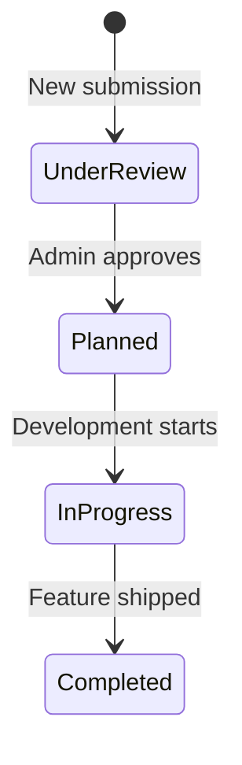

# 02 — FEATURE SPECIFICATION

## Product Overview

**Roadly** is a customer feedback platform (similar to Canny or Featurebase) that enables:
- **End users** to submit feature ideas, vote on them, and participate in discussions
- **Product/admin teams** to review, moderate, prioritize, and track features through a public roadmap

---

## Feature 1: User Authentication System 🔴 REQUIRED

### 1.1 Signup
- **Form fields:** Name, Email, Password, Confirm Password
- **Validation:** Email format, password strength (min 8 chars, 1 uppercase, 1 number — 🟠 IMPLEMENTATION DECISION), name required
- **Flow:** Submit → Create user (password hashed with bcrypt) → Send verification email (simulated) → Redirect to verification notice page
- **Duplicate email:** Return error "Email already registered"

### 1.2 Email Verification Simulation 🔴 REQUIRED
- **Mechanism:** 🟠 IMPLEMENTATION DECISION — Two practical options:
  - **Option A (RECOMMENDED):** Generate a verification token, log it to server console, and provide a `/verify-email/:token` route. The user copies the token from the console.
  - **Option B:** Use Nodemailer with Ethereal (fake SMTP) to send a real email to a test inbox.
- **Token:** Crypto-random string, stored hashed in DB, expires in 24 hours
- **Unverified users:** Can log in but see a "verify your email" banner. 🟠 IMPLEMENTATION DECISION — or block login until verified.

### 1.3 Login
- **Form fields:** Email, Password
- **Validation:** Both required, email format
- **Flow:** Validate credentials → Issue access token (JWT, 15min) → Issue refresh token (JWT, 7d, httpOnly cookie) → Return user data + access token
- **Failed login:** Generic "Invalid credentials" (do not reveal which field is wrong)
- **Token rotation:** Every successful refresh issues a new refresh token and invalidates the old one

### 1.4 Refresh Token Flow
- **Trigger:** Access token expires → Frontend intercepts 401 → Calls refresh endpoint → Receives new access token + new refresh token (rotation)
- **Cookie:** httpOnly, Secure (production), SameSite=Strict, Path=/api/auth
- **Rotation:** Old refresh token is invalidated upon use. Reuse of an old token should invalidate ALL tokens for that user (security measure).

### 1.5 Logout
- **Flow:** Clear refresh token cookie → Invalidate refresh token in DB → Frontend clears access token from memory
- **Logout from all devices:** 🔵 OPTIONAL — Could invalidate all refresh tokens for the user

### 1.6 Forgot Password
- **Form field:** Email
- **Flow:** Submit email → Generate reset token → Simulate email (same as verification) → User visits reset link
- **Security:** Always return "If this email exists, a reset link has been sent" (prevent email enumeration)

### 1.7 Reset Password
- **URL:** `/reset-password/:token`
- **Form fields:** New Password, Confirm New Password
- **Flow:** Validate token → Validate password → Hash and update → Invalidate all refresh tokens → Redirect to login

---

## Feature 2: Feature Request Engine 🔴 REQUIRED

### 2.1 Feature Request Submission

**Trigger:** User clicks "Submit Feature Request" button → Opens modal form

**Modal form fields:**

| Field | Type | Validation | Source |
|-------|------|-----------|--------|
| Title | Text input | Required, 5–150 characters (🟠 IMPLEMENTATION DECISION on limits) | [P01] 2A |
| Description | Markdown editor | Required, 20–5000 characters (🟠 IMPLEMENTATION DECISION on limits) | [P01] 2A |
| Category | Select/tags | Required, one or more from: UI/UX, Integrations, Performance, General | [P01] 2A |

**Markdown editor:** 🟠 IMPLEMENTATION DECISION
- **RECOMMENDED:** Use a simple textarea with Markdown preview toggle. Libraries like `react-markdown` for rendering.
- **Alternative:** Use a WYSIWYG editor like TipTap (adds complexity).

**Post-submission:** Close modal → Show success toast → New request appears at top of feed

**Authentication:** 🔴 REQUIRED — Only authenticated users can submit

### 2.2 Feature Request Feed

**Layout:** Vertical list of request cards

**Each card displays:**
- Title (clickable → detail page)
- Description excerpt (first ~120 characters)
- Author info (name, avatar/initials)
- Status badge (color-coded: Under Review, Planned, In Progress, Completed)
- Vote count + vote button
- Comment count
- Category tag(s)
- Time ago (relative timestamp)

**Pagination:** 🔴 REQUIRED (from deliverables)
- 🟠 IMPLEMENTATION DECISION: Cursor-based or offset-based
- **RECOMMENDED:** Offset-based with page numbers for simplicity. 10–20 items per page.

### 2.3 Sorting 🔴 REQUIRED

| Sort Option | Logic |
|------------|-------|
| Most Upvoted / Trending | By vote count descending. "Trending" could factor in recent vote velocity — 🟠 IMPLEMENTATION DECISION |
| Newest | By `createdAt` descending |
| Most Discussed | By comment count descending |

### 2.4 Filtering 🔴 REQUIRED

| Filter | Options |
|--------|---------|
| Category | UI/UX, Integrations, Performance, General (multi-select) |
| Status | Under Review, Planned, In Progress, Completed (multi-select) |

Filters and sorting should combine. URL query parameters should reflect current filter/sort state for shareability (🟡 RECOMMENDED).

---

## Feature 3: Atomic Upvoting Engine 🔴 REQUIRED

### 3.1 Backend Voting Logic

**MongoDB operations (explicitly required by assessment):**
```
// Upvote (user hasn't voted):
db.posts.updateOne(
  { _id: postId, voters: { $ne: userId } },
  { $addToSet: { voters: userId }, $inc: { voteCount: 1 } }
)

// Remove vote (user already voted):
db.posts.updateOne(
  { _id: postId, voters: userId },
  { $pull: { voters: userId }, $inc: { voteCount: -1 } }
)
```

**Atomic guarantees:**
- `$addToSet` prevents duplicate entries in voters array
- `$inc` atomically updates vote count
- Single-operation update prevents race conditions
- Check `modifiedCount` to confirm the operation succeeded

### 3.2 Duplicate Vote Prevention
- Voters array on the Post document stores user IDs
- Query conditions ensure only valid transitions execute
- Backend validates the user hasn't already voted before applying

### 3.3 Frontend Optimistic UI
1. User clicks vote → Immediately update UI (increment count, mark as voted)
2. Send API request in background
3. **On success:** Keep optimistic state
4. **On failure:** Roll back to previous state, show error toast

### 3.4 Unauthenticated Voting
- Unauthenticated user clicks vote button → Show login/signup modal
- After successful auth → Auto-apply the pending vote (🟡 RECOMMENDED) or let user click again

---

## Feature 4: Threaded Comments & Discussions 🔴 REQUIRED

### 4.1 Comment System
- Comments appear on the feature request detail page
- Support nested/threaded replies (at least 1 level deep — 🟠 IMPLEMENTATION DECISION on max depth)
- **RECOMMENDED:** 2-level threading (top-level comments + replies) to keep UI clean
- Each comment shows: author, content (rendered Markdown), timestamp, edit/delete actions

### 4.2 Markdown Support 🔴 REQUIRED
- Comments support Markdown formatting
- Render with `react-markdown` or similar
- Sanitize HTML output to prevent XSS (use `DOMPurify` or `rehype-sanitize`)

### 4.3 Permissions 🔴 REQUIRED

| Action | Author | Admin | Other Users |
|--------|--------|-------|-------------|
| Create comment | ✅ (authenticated) | ✅ | ✅ (authenticated) |
| Edit comment | ✅ (own only) | ✅ (any) | ❌ |
| Delete comment | ✅ (own only) | ✅ (any) | ❌ |

- Edited comments should show "(edited)" indicator (🟡 RECOMMENDED)
- Deleted comments in threads: Show "[deleted]" placeholder if they have replies, hard-delete if no replies (🟠 IMPLEMENTATION DECISION)

---

## Feature 5: Admin Controls & RBAC 🔴 REQUIRED

### 5.1 Role-Based Access Control

**Minimum roles:**

| Role | Scope |
|------|-------|
| `user` | Default role. Can submit, vote, comment, edit/delete own content |
| `admin` | All user permissions + manage all content + status transitions + moderation |

> [!NOTE]
> The assessment says "RBAC" but only requires user/admin distinction. Adding roles like `moderator` is 🔵 OPTIONAL. Keep it simple.

### 5.2 Status Transitions 🔴 REQUIRED



- Only admins can change status
- Status flow is sequential: Under Review → Planned → In Progress → Completed
- 🟠 IMPLEMENTATION DECISION: Allow backwards transitions? **RECOMMENDED:** Yes, admins should be able to move items back.

### 5.3 Admin Panel
- View/manage all feature requests
- Change request status
- Edit/delete any request
- Edit/delete any comment (moderation)
- View engagement metrics (🔵 OPTIONAL — see Extra Features)

---

## Feature 6: Public Kanban Roadmap 🔴 REQUIRED

### 6.1 Layout
- Three-column Kanban board displaying: **Planned**, **In Progress**, **Completed**
- "Under Review" items do NOT appear on the roadmap (they're in the feed/admin panel)
- 🟠 IMPLEMENTATION DECISION: This interpretation matches "3-column" with 4 statuses

### 6.2 Cards on Roadmap
Each card shows:
- Title
- Category tag
- Vote count
- Comment count (🟡 RECOMMENDED)

### 6.3 Synchronization
- Roadmap reflects current backend state
- When admin changes a status, the roadmap updates
- 🟠 IMPLEMENTATION DECISION: Real-time (WebSocket) vs polling vs refetch-on-focus
- **RECOMMENDED:** React Query with refetch-on-window-focus for simplicity. WebSocket is 🔵 OPTIONAL.

### 6.4 Public Access
- The roadmap is publicly visible — no authentication required
- Anyone (including unauthenticated users) can view the roadmap

---

## Feature 7: Search 🔴 REQUIRED

### 7.1 Full-Text Search
- Search across feature request titles and descriptions
- **Debounced:** Wait 300ms after user stops typing before sending request (🟠 IMPLEMENTATION DECISION on debounce timing)

### 7.2 Implementation Strategy
- 🟠 IMPLEMENTATION DECISION — options:
  - **Option A (RECOMMENDED):** MongoDB text index on `title` and `description` fields. Use `$text` + `$search` operator.
  - **Option B:** MongoDB Atlas Search (requires Atlas deployment).
  - **Option C:** Simple regex search (works but less performant).
- **RECOMMENDED:** Option A — MongoDB text index. Simple, built-in, works with local MongoDB.

---

## Feature 8: System UX 🔴 REQUIRED

### 8.1 Loading States
- Skeleton loaders for feed, roadmap, detail page
- Button loading states during form submissions
- Full-page loading state for initial app load

### 8.2 Empty States
- "No feature requests yet" with CTA to submit one
- "No results found" for search/filter with suggestion to adjust criteria
- "No comments yet" with CTA to start discussion

### 8.3 Error States
- Network error with retry button
- 404 page for invalid routes/requests
- Form validation errors (inline)
- API error handling with user-friendly messages

### 8.4 Toast Notifications
- Success: Request submitted, vote recorded, comment posted
- Error: Operation failed, unauthorized action
- Info: Session expired, please log in again
- Use Coss UI toast component
