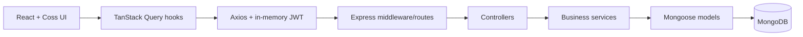

# Architecture

Roadly uses two npm workspaces. React renders the browser application; Express exposes JSON REST under `/api`; Mongoose persists domain data to MongoDB.

## Boundaries

Backend routes register paths and middleware; controllers choose response status/envelopes; services enforce ownership, lifecycle, voting, comments, projection, pagination, and analytics; models own schemas/indexes/password hashing. Configuration validates runtime environment and connects the database.

Frontend `api/` owns HTTP and envelope parsing. Hooks own queries and mutations. Pages compose focused Coss components. Context owns auth, theme, and shared submission UI. Server records stay in TanStack Query instead of duplicated global state.

Identity comes from server authentication. Client input cannot assign roles or write protected voters, counters, status, or activity metadata. [Security](06-AUTH-SECURITY.md) describes the boundary.

## Data and consistency

- Single-document atomic votes protect the voter set and count together.
- Comments use adjacency-list roots and one reply level. Replies are fetched in a batch.
- `commentCount` counts active roots and replies.
- Admin lists reuse the post service, with one search/filter implementation.
- Roadmap queries use a narrow projection; insights use aggregation and bounded top-five lists.
- Activity is separate, best-effort product history rather than a compliance audit trail.

Cross-collection operations do not provide a general transaction boundary on standalone MongoDB. A crash during comment/post cleanup or counter maintenance can need reconciliation. Embedded voters, offset pagination, all replies for visible roots, and an unpaginated roadmap are assessment-scale choices.

## Communication and operations

Success is `{ success: true, data, meta? }`; failures use `{ success: false, error }`. [API specification](05-API-SPECIFICATION.md) defines exact contracts. MongoDB text search covers title and description and preserves requested sorting. Clients cannot send arbitrary query operators.

The client build is static; the server runs compiled JavaScript. Environment files are local only. The database-aware health endpoint distinguishes a connected API from an unavailable database. Public deployment needs provisioned services and a production email decision; see [deployment](13-DEPLOYMENT.md).
