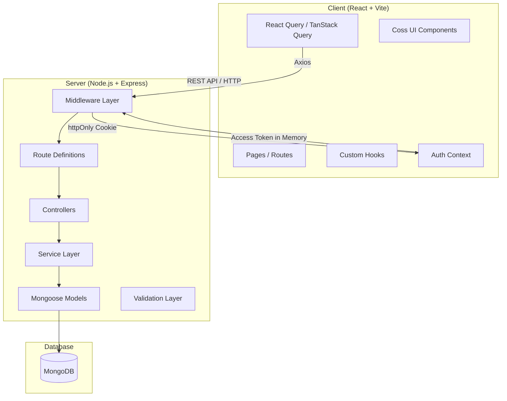
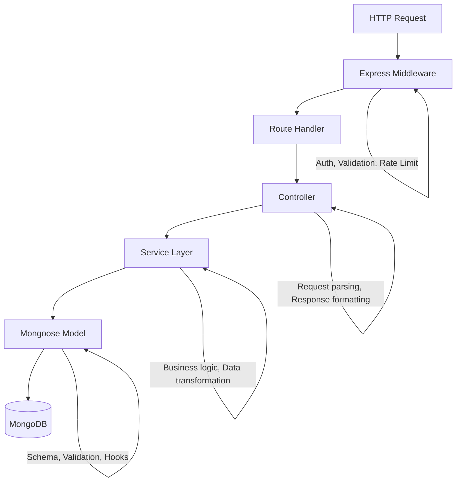
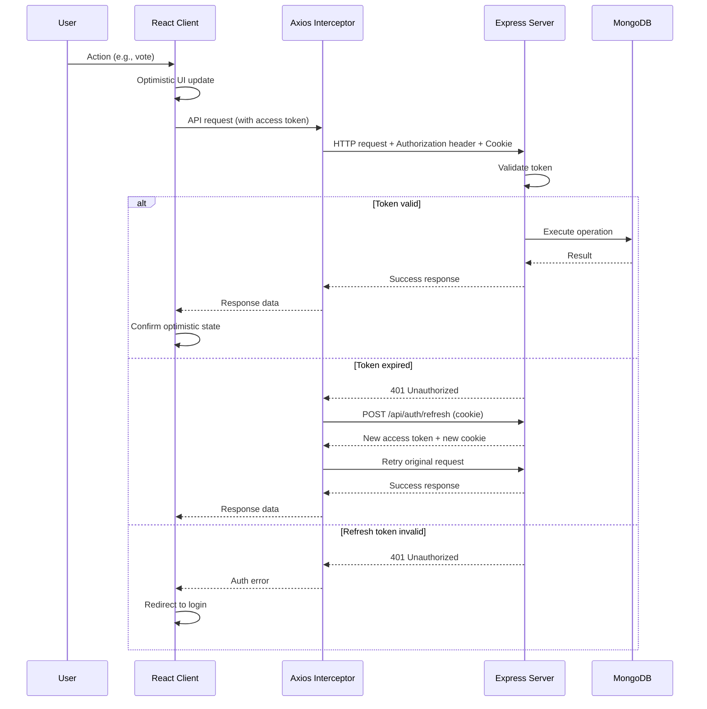

# 03 — ARCHITECTURE

## System Architecture Overview

Roadly follows a standard MERN monorepo architecture with clear frontend/backend separation.



---

## Architecture Principles

| Principle | Description | Classification |
|-----------|-------------|---------------|
| Monorepo | Single repository with `client/` and `server/` directories | 🟡 RECOMMENDED |
| REST API | RESTful HTTP API between client and server | 🔴 REQUIRED (implied by assessment) |
| Layered Backend | Routes → Controllers → Services → Models | 🟡 RECOMMENDED |
| Separation of Concerns | Business logic in services, not in controllers or routes | 🟡 RECOMMENDED |
| Centralized Error Handling | Express error middleware catches and formats all errors | 🟡 RECOMMENDED |
| Stateless Auth | JWT-based, no server-side session storage (except refresh tokens) | 🔴 REQUIRED |

---

## Backend Architecture

### Layer Responsibilities



#### Routes (`server/src/routes/`)
- Define URL patterns and HTTP methods
- Attach middleware (auth, validation, rate limiting)
- Delegate to controllers
- **No business logic here**

#### Controllers (`server/src/controllers/`)
- Parse and validate request parameters
- Call appropriate service methods
- Format and send HTTP responses
- Handle controller-level errors
- **No direct database access**

#### Services (`server/src/services/`)
- Contain all business logic
- Interact with Mongoose models
- Handle data transformation
- Throw application-specific errors
- **Reusable across different controllers if needed**

#### Models (`server/src/models/`)
- Define Mongoose schemas and validation
- Define indexes
- Define instance/static methods where appropriate
- Define pre/post hooks (e.g., password hashing)

> [!IMPORTANT]
> Avoid "giant controllers" anti-pattern. If a controller method exceeds ~50 lines, business logic should be extracted to the service layer.

---

### Middleware Stack

| Middleware | Purpose | Order | Classification |
|-----------|---------|-------|---------------|
| `helmet` | Security headers | 1st | 🟡 RECOMMENDED |
| `cors` | Cross-origin configuration | 2nd | 🔴 REQUIRED |
| `express.json()` | Body parsing | 3rd | 🔴 REQUIRED |
| `cookieParser` | Parse httpOnly cookies | 4th | 🔴 REQUIRED |
| `morgan` / custom logger | Request logging | 5th | 🟡 RECOMMENDED |
| `rateLimiter` | Rate limiting on auth routes | Per-route | 🟡 RECOMMENDED |
| `authenticate` | Verify access token | Per-route | 🔴 REQUIRED |
| `authorize(roles)` | Check user role | Per-route | 🔴 REQUIRED |
| `validate(schema)` | Request validation | Per-route | 🔴 REQUIRED |
| `errorHandler` | Centralized error handling | Last | 🟡 RECOMMENDED |

---

### Error Handling Strategy 🟡 RECOMMENDED

**Centralized error handler pattern:**

All errors flow through a global Express error middleware. Application errors extend a base `AppError` class.

**Standard error response format:**
```json
{
  "success": false,
  "error": {
    "message": "Human-readable error message",
    "code": "VALIDATION_ERROR",
    "statusCode": 400,
    "details": []
  }
}
```

**Standard success response format:**
```json
{
  "success": true,
  "data": {},
  "meta": {
    "page": 1,
    "limit": 10,
    "total": 42,
    "totalPages": 5
  }
}
```

**Error categories:**

| Code | HTTP Status | Usage |
|------|------------|-------|
| `VALIDATION_ERROR` | 400 | Invalid input |
| `UNAUTHORIZED` | 401 | Not authenticated |
| `FORBIDDEN` | 403 | Not authorized (wrong role) |
| `NOT_FOUND` | 404 | Resource not found |
| `CONFLICT` | 409 | Duplicate resource (e.g., email already exists) |
| `RATE_LIMITED` | 429 | Too many requests |
| `INTERNAL_ERROR` | 500 | Unexpected server error |

---

### Validation Strategy 🟡 RECOMMENDED

- **Library:** `express-validator` or `zod`
- 🟠 IMPLEMENTATION DECISION: Both are valid choices
  - **`zod` (RECOMMENDED):** TypeScript-first, can share schemas between client/server, composable
  - **`express-validator`:** Express-native, chain-based validation
- Validation runs in middleware before the controller
- Return all validation errors at once (not fail-on-first)

---

## Frontend Architecture

See [07-FRONTEND-ARCHITECTURE.md](file:///c:/Users/MOBILE/Desktop/com.bot%20project/docs/07-FRONTEND-ARCHITECTURE.md) for detailed frontend design.

### High-Level Frontend Stack

| Concern | Technology | Classification |
|---------|-----------|---------------|
| UI Framework | React 18+ | 🔴 REQUIRED |
| Language | TypeScript | 🟡 RECOMMENDED |
| Build Tool | Vite | 🟡 RECOMMENDED |
| Routing | React Router v6 | 🟡 RECOMMENDED |
| Server State | TanStack Query (React Query) v5 | 🟡 RECOMMENDED |
| Local State | React Context + useReducer | 🟡 RECOMMENDED |
| HTTP Client | Axios | 🟡 RECOMMENDED |
| UI Primitives | Coss UI | 🔴 REQUIRED |
| Styling | Tailwind CSS v4 | 🔴 REQUIRED (Coss UI dependency) |
| Markdown Rendering | react-markdown + rehype-sanitize | 🟡 RECOMMENDED |
| Form Handling | React Hook Form + zod resolver | 🟡 RECOMMENDED |

---

## API Communication Pattern



---

## Pagination Strategy 🟡 RECOMMENDED

**Approach:** Offset-based pagination with page numbers

| Parameter | Default | Max |
|-----------|---------|-----|
| `page` | 1 | — |
| `limit` | 10 | 50 |
| `sort` | `-createdAt` | — |

**Response meta:**
```json
{
  "meta": {
    "page": 1,
    "limit": 10,
    "total": 42,
    "totalPages": 5,
    "hasNextPage": true,
    "hasPrevPage": false
  }
}
```

**Why offset-based over cursor-based:** Simpler to implement, supports page numbers in UI, adequate for the expected data volume. Cursor-based would be better for infinite scroll but adds complexity.

---

## Search Strategy 🟡 RECOMMENDED

- Create MongoDB text index on `title` and `description` fields
- Use `$text` search with `$meta: "textScore"` for relevance sorting
- Frontend debounces search input (300ms)
- Search combines with existing filters and sorting
- Minimum 2 characters to trigger search (🟠 IMPLEMENTATION DECISION)

---

## Indexing Strategy 🟡 RECOMMENDED

Documented in detail in [04-DATABASE-DESIGN.md](file:///c:/Users/MOBILE/Desktop/com.bot%20project/docs/04-DATABASE-DESIGN.md).

Key indexes:
- Text index on Post `title` + `description`
- Compound index on Post `status` + `createdAt`
- Index on Post `voteCount`
- Index on Post `commentCount`
- Index on Comment `post` + `createdAt`
- Unique index on User `email`
- Index on RefreshToken `token` + `expiresAt`

---

## Logging Strategy 🟡 RECOMMENDED

- **Development:** `morgan` for HTTP request logging, `console.log` for debug
- **Production:** Structured JSON logs, no `console.log` (use a logger like `winston` or `pino`)
- 🟠 IMPLEMENTATION DECISION: `morgan` for request logs is sufficient for assessment scope. Full structured logging with `winston`/`pino` is 🔵 OPTIONAL.

---

## Configuration & Environment Variables

All configuration via environment variables. No hardcoded values.

See [13-DEPLOYMENT.md](file:///c:/Users/MOBILE/Desktop/com.bot%20project/docs/13-DEPLOYMENT.md) for full environment variable list.

**Minimum required `.env` variables:**
```
NODE_ENV=development
PORT=5000
MONGODB_URI=mongodb://localhost:27017/roadly
JWT_ACCESS_SECRET=<random-secret>
JWT_REFRESH_SECRET=<different-random-secret>
JWT_ACCESS_EXPIRY=15m
JWT_REFRESH_EXPIRY=7d
CLIENT_URL=http://localhost:5173
```

---

## Security Architecture

See [06-AUTH-SECURITY.md](file:///c:/Users/MOBILE/Desktop/com.bot%20project/docs/06-AUTH-SECURITY.md) for comprehensive security design.

**Key security decisions:**
- Access token: In-memory only (React state/context). **Never in localStorage.**
- Refresh token: httpOnly cookie only.
- CORS: Whitelist `CLIENT_URL` only.
- Passwords: bcrypt with salt rounds 12.
- Input sanitization: All user inputs validated and sanitized before DB operations.
