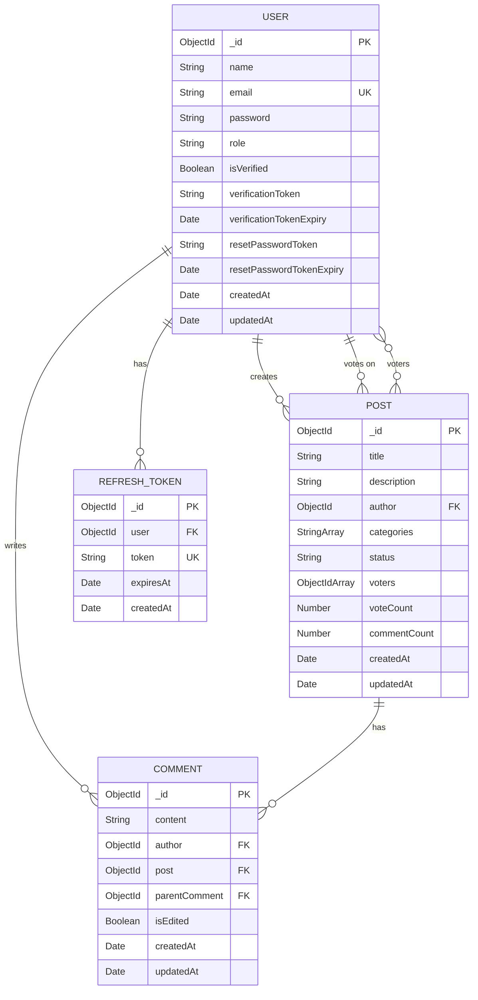

# 04 — DATABASE DESIGN

## Overview

MongoDB with Mongoose ODM. All collections designed specifically for Roadly's requirements.

---

## Entity Relationship Diagram

---

## Collection: Users

### Purpose
Stores all registered users including both regular users and admins.

### Schema Design

| Field | Type | Required | Default | Validation | Notes |
|-------|------|----------|---------|------------|-------|
| `_id` | ObjectId | Auto | Auto | — | Primary key |
| `name` | String | ✅ | — | 2–50 chars, trimmed | Display name |
| `email` | String | ✅ | — | Valid email format, lowercase, trimmed | Unique constraint |
| `password` | String | ✅ | — | Min 8 chars (pre-hash), hashed with bcrypt | Never returned in queries |
| `role` | String | ✅ | `"user"` | Enum: `["user", "admin"]` | RBAC |
| `isVerified` | Boolean | ✅ | `false` | — | Email verification status |
| `verificationToken` | String | ❌ | — | — | Hashed token for email verification |
| `verificationTokenExpiry` | Date | ❌ | — | — | Token expiration (24h from creation) |
| `resetPasswordToken` | String | ❌ | — | — | Hashed token for password reset |
| `resetPasswordTokenExpiry` | Date | ❌ | — | — | Token expiration (1h from creation) |
| `createdAt` | Date | Auto | Auto | — | Mongoose timestamps |
| `updatedAt` | Date | Auto | Auto | — | Mongoose timestamps |

### Indexes

| Index | Type | Fields | Purpose |
|-------|------|--------|---------|
| email_unique | Unique | `{ email: 1 }` | Prevent duplicate registrations, fast login lookup |
| verification_token | Sparse | `{ verificationToken: 1 }` | Fast token lookup during verification |
| reset_token | Sparse | `{ resetPasswordToken: 1 }` | Fast token lookup during password reset |

### Security Considerations
- **Password** is hashed with bcrypt (salt rounds: 12) via a Mongoose `pre('save')` hook
- **Password** field uses `select: false` in schema — never included in query results unless explicitly selected
- **Verification/reset tokens** are stored as hashed values (SHA-256), not plaintext
- **Role** cannot be changed through user-facing APIs. Admin promotion is a protected admin-only operation.

### Lifecycle
1. Created on signup (isVerified: false)
2. Verified when user clicks verification link
3. Updated on profile changes
4. Never hard-deleted (🟠 IMPLEMENTATION DECISION — soft delete or no delete for assessment scope)

---

## Collection: Posts (Feature Requests)

### Purpose
Stores all feature requests submitted by users. This is the core domain entity.

### Schema Design

| Field | Type | Required | Default | Validation | Notes |
|-------|------|----------|---------|------------|-------|
| `_id` | ObjectId | Auto | Auto | — | Primary key |
| `title` | String | ✅ | — | 5–150 chars, trimmed | Feature request title |
| `description` | String | ✅ | — | 20–5000 chars | Markdown content |
| `author` | ObjectId | ✅ | — | Ref: `User` | User who submitted |
| `categories` | [String] | ✅ | — | Enum: `["ui-ux", "integrations", "performance", "general"]`, min 1 | From assessment: UI/UX, Integrations, Performance, General |
| `status` | String | ✅ | `"under-review"` | Enum: `["under-review", "planned", "in-progress", "completed"]` | Status flow from assessment |
| `voters` | [ObjectId] | ✅ | `[]` | Ref: `User` | Array of user IDs who upvoted |
| `voteCount` | Number | ✅ | `0` | Min: 0 | Denormalized count for sorting/display |
| `commentCount` | Number | ✅ | `0` | Min: 0 | Denormalized count for sorting/display |
| `createdAt` | Date | Auto | Auto | — | Mongoose timestamps |
| `updatedAt` | Date | Auto | Auto | — | Mongoose timestamps |

### Indexes

| Index | Type | Fields | Purpose |
|-------|------|--------|---------|
| text_search | Text | `{ title: "text", description: "text" }` | Full-text search (🔴 REQUIRED) |
| status_created | Compound | `{ status: 1, createdAt: -1 }` | Roadmap queries + filtered feed |
| vote_sort | Single | `{ voteCount: -1 }` | "Most Upvoted" sort |
| comment_sort | Single | `{ commentCount: -1 }` | "Most Discussed" sort |
| created_sort | Single | `{ createdAt: -1 }` | "Newest" sort |
| author_lookup | Single | `{ author: 1 }` | "My Requests" page |

### Voting Architecture — Detailed Explanation 🔴 REQUIRED

The assessment explicitly requires atomic MongoDB operators (`$addToSet`, `$pull`, `$inc`).

**Why this design:**

1. **`voters` array on Post document:** Stores the set of user IDs who have voted. This enables:
   - Duplicate prevention via `$addToSet` (MongoDB set semantics)
   - Quick lookup of whether the current user has voted (check if userId is in voters array)
   - Atomic toggle in a single update operation

2. **`voteCount` as denormalized field:** While `voters.length` could be computed, storing `voteCount` separately enables:
   - Efficient sorting by votes without computing array length
   - Index-backed sort queries
   - Consistent count via atomic `$inc` (not computed)

3. **Atomicity guarantee:**
   - Upvote uses a single `updateOne` with filter `{ _id: postId, voters: { $ne: userId } }` ensuring the user hasn't already voted, combined with `{ $addToSet: { voters: userId }, $inc: { voteCount: 1 } }`.
   - If the user has already voted, the filter doesn't match → `modifiedCount: 0` → no duplicate.
   - Both the array add and count increment happen in ONE atomic MongoDB operation.

4. **Vote removal:** Same pattern with `$pull` + `$inc: { voteCount: -1 }`, filtered by `{ voters: userId }`.

5. **Rollback on error:**
   - Frontend immediately shows the vote (optimistic UI)
   - If the API request fails (network error, validation error, server error), the frontend reverts:
     - Decrement the displayed count
     - Remove the "voted" visual state
     - Show error toast

6. **Consistency:**
   - `voteCount` should always equal `voters.length`. If drift occurs (unlikely with atomic ops), a periodic consistency check could reconcile (🔵 OPTIONAL).

**Potential concern: voters array size**
- For an assessment project, the voters array will not grow to problematic sizes
- For production at scale, a separate `Vote` collection would be needed. For Roadly, embedded is appropriate.

### Security Considerations
- Only authenticated users can create posts
- Only the author can edit their own post title/description (🟠 IMPLEMENTATION DECISION)
- Only admins can change status
- `voteCount` and `voters` cannot be set directly via API (only modified through vote endpoints)

---

## Collection: Comments

### Purpose
Stores threaded comments on feature requests.

### Schema Design

| Field | Type | Required | Default | Validation | Notes |
|-------|------|----------|---------|------------|-------|
| `_id` | ObjectId | Auto | Auto | — | Primary key |
| `content` | String | ✅ | — | 1–2000 chars | Markdown content |
| `author` | ObjectId | ✅ | — | Ref: `User` | Comment author |
| `post` | ObjectId | ✅ | — | Ref: `Post` | Parent feature request |
| `parentComment` | ObjectId | ❌ | `null` | Ref: `Comment` | For threading — null = top-level comment |
| `isEdited` | Boolean | ✅ | `false` | — | Shows "(edited)" indicator |
| `createdAt` | Date | Auto | Auto | — | Mongoose timestamps |
| `updatedAt` | Date | Auto | Auto | — | Mongoose timestamps |

### Threading Model 🟡 RECOMMENDED

**Approach: Adjacency List (parentComment reference)**
- Top-level comments have `parentComment: null`
- Replies reference their parent comment's `_id`
- Max depth: 2 levels (top-level + replies) — enforced in application logic
- Deeper nesting adds UI complexity without proportional value for this assessment

**Why not nested/embedded comments:**
- Embedded comments hit the 16MB document limit
- Individual comment operations (edit/delete) are simpler with separate documents
- Pagination of comments is straightforward

**Query pattern for threaded display:**
1. Fetch all comments for a post: `Comment.find({ post: postId }).sort({ createdAt: 1 }).populate('author', 'name')`
2. Client-side: Group by `parentComment` to build thread structure

### Indexes

| Index | Type | Fields | Purpose |
|-------|------|--------|---------|
| post_created | Compound | `{ post: 1, createdAt: 1 }` | Fetch comments for a post, sorted by time |
| author_lookup | Single | `{ author: 1 }` | User's comment history |

### Post Comment Count Maintenance
- When a comment is created: `Post.updateOne({ _id: postId }, { $inc: { commentCount: 1 } })`
- When a comment is deleted: `Post.updateOne({ _id: postId }, { $inc: { commentCount: -1 } })`
- Use Mongoose post hooks or service-layer logic (🟠 IMPLEMENTATION DECISION)

### Security Considerations
- Only authenticated users can create comments
- Authors can edit/delete their own comments
- Admins can edit/delete any comment (moderation)
- Content is sanitized for XSS before rendering (client-side)

---

## Collection: RefreshTokens

### Purpose
Stores active refresh tokens for session management and token rotation.

### Schema Design

| Field | Type | Required | Default | Validation | Notes |
|-------|------|----------|---------|------------|-------|
| `_id` | ObjectId | Auto | Auto | — | Primary key |
| `user` | ObjectId | ✅ | — | Ref: `User` | Token owner |
| `token` | String | ✅ | — | — | Hashed refresh token |
| `expiresAt` | Date | ✅ | — | — | 7 days from creation |
| `createdAt` | Date | Auto | Auto | — | Mongoose timestamps |

### Indexes

| Index | Type | Fields | Purpose |
|-------|------|--------|---------|
| token_unique | Unique | `{ token: 1 }` | Fast token lookup during refresh |
| user_lookup | Single | `{ user: 1 }` | Revoke all tokens for a user |
| expires_ttl | TTL | `{ expiresAt: 1 }`, expireAfterSeconds: 0 | Auto-delete expired tokens |

### Token Rotation Security
1. On refresh: Find token → Verify not expired → Delete old token → Create new token → Return new access + refresh
2. **Reuse detection:** If a previously-used (deleted) token is presented, it indicates potential theft. Response: Delete ALL refresh tokens for that user (force re-login on all devices). 🟡 RECOMMENDED.
3. TTL index auto-cleans expired tokens (MongoDB handles garbage collection)

### Why a Separate Collection (vs embedded in User)
- Allows multiple active sessions (different devices)
- TTL index for automatic cleanup
- Easy to revoke all sessions (`deleteMany({ user: userId })`)
- No unbounded array growth on User document

---

## Database Design Decisions Summary

| Decision | Choice | Reasoning |
|----------|--------|-----------|
| Voters storage | Embedded array on Post | Simple, atomic operations, adequate for assessment scale |
| Comment threading | Adjacency list (parentComment ref) | Simple queries, individual CRUD, pagination support |
| Refresh tokens | Separate collection | TTL cleanup, multi-device support, token rotation |
| Comment count | Denormalized on Post | Efficient sorting, one fewer aggregation |
| Vote count | Denormalized on Post | Efficient sorting, atomic with `$inc` |
| Soft delete | Not used (hard delete) | Simpler for assessment scope. Soft delete is 🔵 OPTIONAL |
| User deletion | Not supported | Out of scope for assessment |
