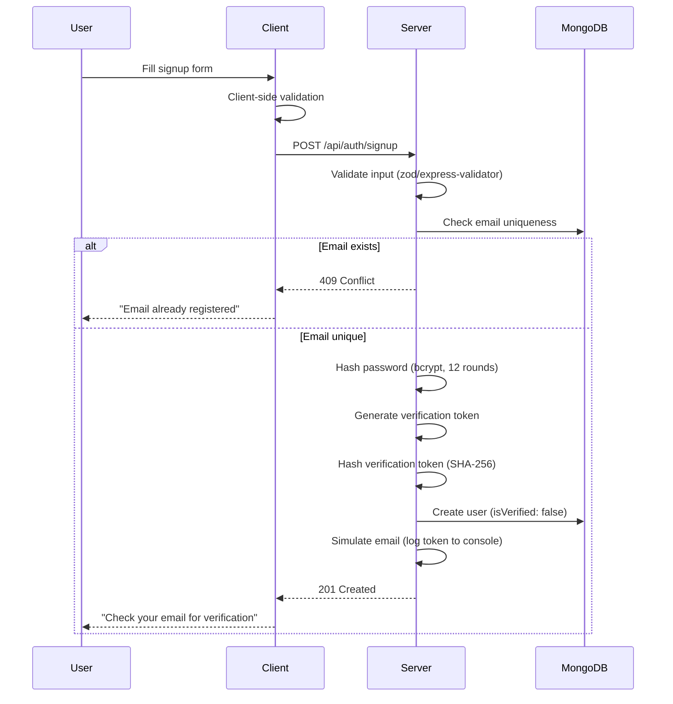
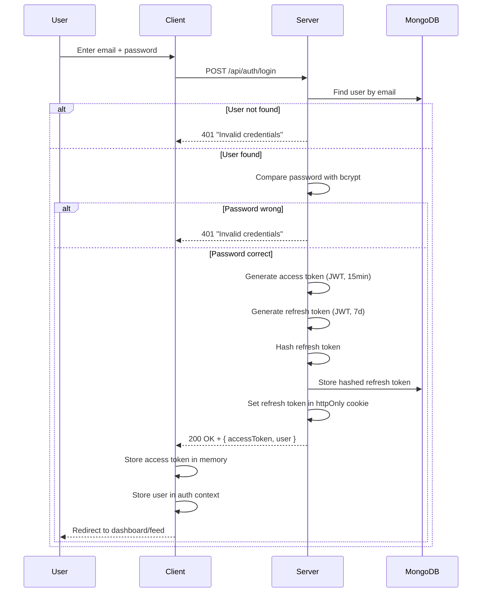
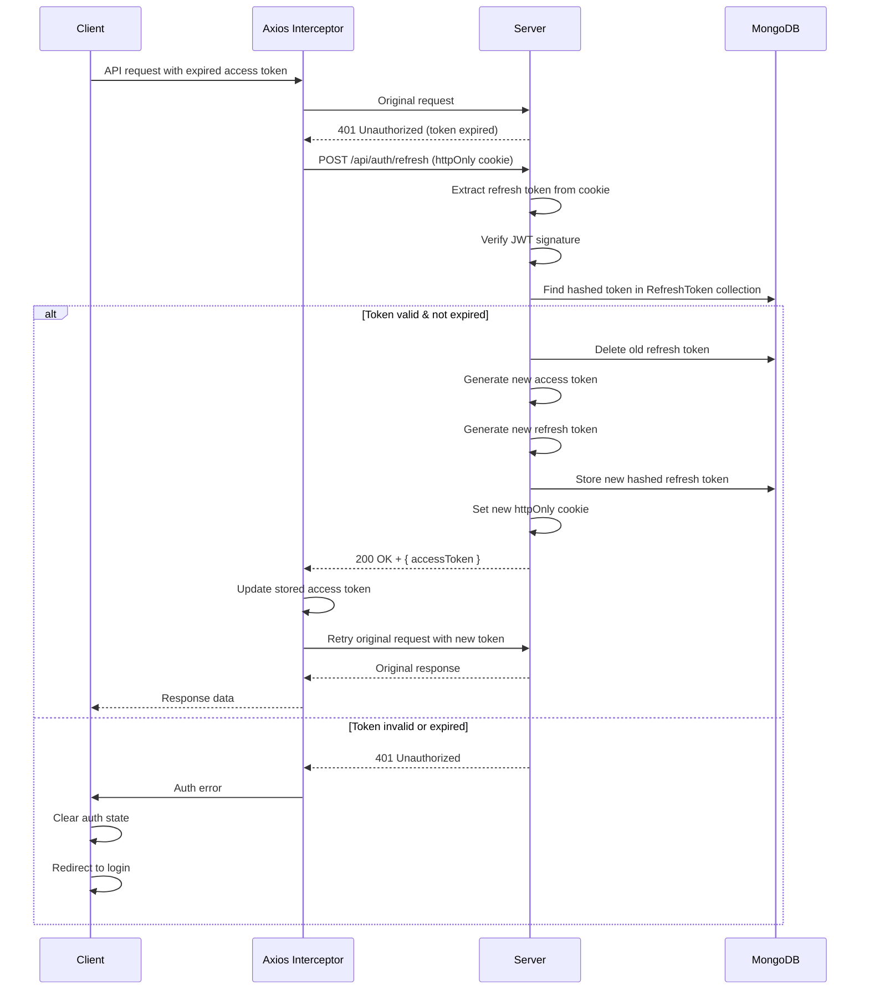
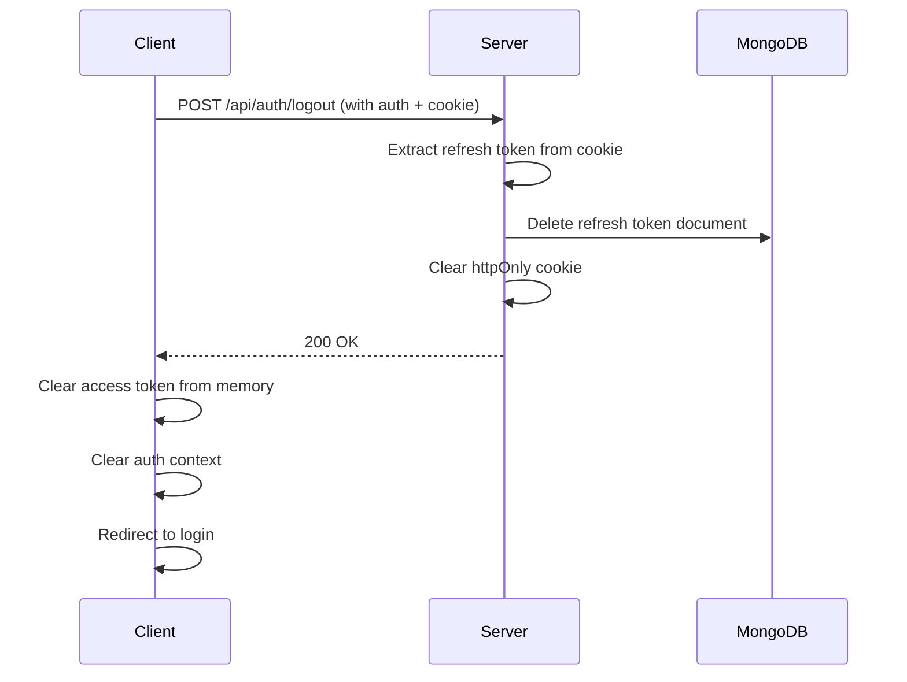
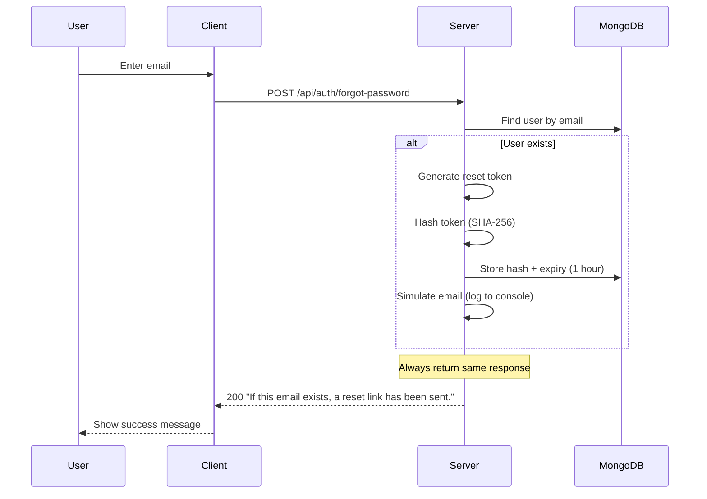
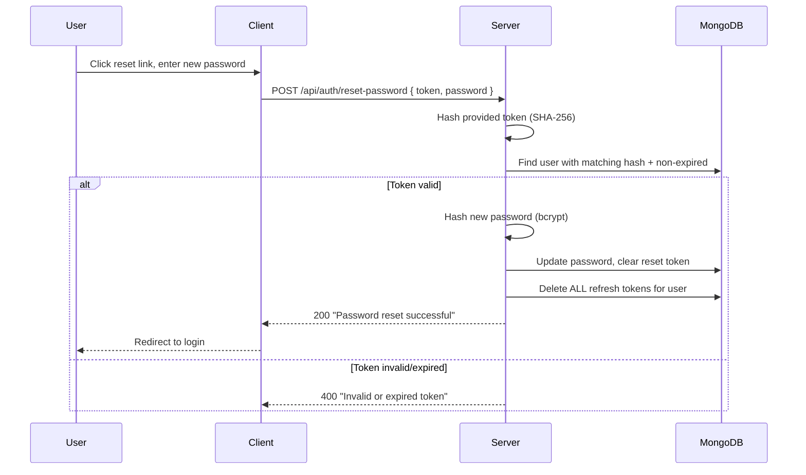

# 06 — AUTHENTICATION & SECURITY

## Authentication Architecture Overview

Roadly uses a **Dual-Token JWT** system as mandated by the assessment:

| Token | Type | Lifetime | Storage | Purpose |
|-------|------|----------|---------|---------|
| Access Token | JWT | 15 minutes | In-memory (React state) | API authorization |
| Refresh Token | JWT | 7 days | httpOnly cookie | Session persistence, token renewal |

> [!CAUTION]
> **NEVER store JWT access tokens in localStorage or sessionStorage.** The assessment implies secure token handling. Access tokens live only in JavaScript memory (React context/state). They are lost on page refresh and must be reacquired via the refresh endpoint.

---

## Authentication Flows

### Signup Flow



### Email Verification Simulation 🔴 REQUIRED

**The assessment says "Email Verification simulation"** — this means we simulate the email sending process rather than actually sending emails.

**RECOMMENDED Implementation:**
1. Generate a crypto-random token (32 bytes hex)
2. Hash it with SHA-256 and store the hash in the user document
3. Log the raw token + verification URL to the server console:
   ```
   [EMAIL SIMULATION] Verification link: http://localhost:5173/verify-email?token=abc123...
   ```
4. User copies the URL from the console and visits it
5. Server validates: hash the provided token → compare with stored hash → check expiry

### Login Flow



### Token Refresh Flow



**Token Rotation Security:**
- Every refresh issues a NEW refresh token and invalidates the old one
- If a previously-used (deleted) token is presented → **REUSE DETECTION**
  - Delete ALL refresh tokens for that user
  - Force re-login on all devices
  - This prevents replay attacks if a token is stolen

### Logout Flow



### Forgot Password Flow



### Reset Password Flow



---

## Cookie Configuration 🔴 REQUIRED

```javascript
// Cookie settings for refresh token
{
  httpOnly: true,                    // Not accessible via JavaScript
  secure: process.env.NODE_ENV === 'production',  // HTTPS only in prod
  sameSite: 'strict',               // Prevent CSRF
  path: '/api/auth',                // Only sent to auth endpoints
  maxAge: 7 * 24 * 60 * 60 * 1000  // 7 days in milliseconds
}
```

**Why these settings:**
- `httpOnly`: Prevents XSS from reading the token
- `secure`: Ensures HTTPS in production
- `sameSite: 'strict'`: Prevents CSRF attacks
- `path: '/api/auth'`: Token only sent to auth-related endpoints (minimize exposure)
- `maxAge`: Matches refresh token lifetime

---

## RBAC (Role-Based Access Control) 🔴 REQUIRED

### Roles

| Role | Description |
|------|-------------|
| `user` | Default role for registered users |
| `admin` | Full system access, content moderation, status management |

### Permission Matrix

| Resource / Action | `user` | `admin` |
|-------------------|--------|---------|
| **Feature Requests** | | |
| View all posts | ✅ | ✅ |
| Create post | ✅ | ✅ |
| Edit own post | ✅ | ✅ |
| Edit any post | ❌ | ✅ |
| Delete own post | ✅ | ✅ |
| Delete any post | ❌ | ✅ |
| Change post status | ❌ | ✅ |
| **Voting** | | |
| Vote on posts | ✅ | ✅ |
| **Comments** | | |
| View comments | ✅ | ✅ |
| Create comment | ✅ | ✅ |
| Edit own comment | ✅ | ✅ |
| Edit any comment | ❌ | ✅ |
| Delete own comment | ✅ | ✅ |
| Delete any comment | ❌ | ✅ |
| **Roadmap** | | |
| View roadmap | ✅ (public) | ✅ |
| Manage roadmap status | ❌ | ✅ |
| **Admin Panel** | | |
| Access admin panel | ❌ | ✅ |
| View admin analytics | ❌ | ✅ (🔵 OPTIONAL) |

### Authorization Middleware

```
// Pseudocode for authorize middleware
function authorize(...roles) {
  return (req, res, next) => {
    if (!req.user) return 401;
    if (!roles.includes(req.user.role)) return 403;
    next();
  }
}

// Usage in routes:
router.patch('/posts/:id/status', authenticate, authorize('admin'), controller);
```

> [!IMPORTANT]
> Authorization must be enforced at the **API level**, not just the frontend. Frontend route guards prevent navigation but do not secure the system.

---

## Security Measures

### Password Security
- **Hashing:** bcrypt with salt rounds = 12
- **Storage:** Only hashed password stored; `select: false` in Mongoose schema
- **Validation:** Minimum 8 characters (🟠 IMPLEMENTATION DECISION on complexity rules)
- **Comparison:** `bcrypt.compare()` (timing-safe)

### Token Security
- **Access Token:** Signed with `JWT_ACCESS_SECRET`, contains `{ userId, role }`, 15min expiry
- **Refresh Token:** Signed with `JWT_REFRESH_SECRET` (different secret), contains `{ userId, tokenVersion }`, 7d expiry
- **Token Storage (DB):** Hashed with SHA-256 before storing in RefreshToken collection
- **Secrets:** Environment variables only, never in source code

### Input Validation
- All endpoints validate input before processing
- Validation library (zod or express-validator) in middleware
- MongoDB injection prevention: Mongoose parameterized queries + schema validation
- XSS prevention: Sanitize user content before rendering (client-side `DOMPurify`/`rehype-sanitize`)

### Rate Limiting 🟡 RECOMMENDED
- Auth endpoints: Stricter limits (5-10 requests/15min per IP)
- General API: Standard limits (100 requests/15min per IP)
- Library: `express-rate-limit`

### CORS Configuration 🔴 REQUIRED
```javascript
{
  origin: process.env.CLIENT_URL, // Only allow the frontend origin
  credentials: true,              // Allow cookies
  methods: ['GET', 'POST', 'PUT', 'PATCH', 'DELETE'],
  allowedHeaders: ['Content-Type', 'Authorization']
}
```

### Security Headers 🟡 RECOMMENDED
- Use `helmet` middleware for common security headers
- Content-Security-Policy, X-Content-Type-Options, X-Frame-Options, etc.

### Attack Considerations

| Attack | Mitigation |
|--------|------------|
| **XSS** | httpOnly cookies, input sanitization, CSP headers |
| **CSRF** | SameSite=Strict cookies, CORS whitelist |
| **Brute Force** | Rate limiting on auth endpoints |
| **Token Theft** | Token rotation, reuse detection, short access token lifetime |
| **SQL/NoSQL Injection** | Mongoose parameterized queries, input validation |
| **Email Enumeration** | Generic responses on forgot-password and login failure |
| **Password Leak** | bcrypt hashing, `select: false`, never log passwords |
| **Privilege Escalation** | Server-side role checks, role cannot be set via user-facing API |

---

## Admin Account Setup

🟠 IMPLEMENTATION DECISION — How to create the first admin:

**RECOMMENDED:** Seed script that creates an admin user, or an environment variable that designates an email as admin on first registration.

Options:
1. **Database seed script** (RECOMMENDED): `npm run seed:admin` creates admin user
2. **Environment variable:** `ADMIN_EMAIL=admin@roadly.com` — auto-promotes this email to admin on registration
3. **Manual DB update:** After registration, manually update role in MongoDB

For assessment purposes, Option 1 (seed script) is cleanest and most explainable.
