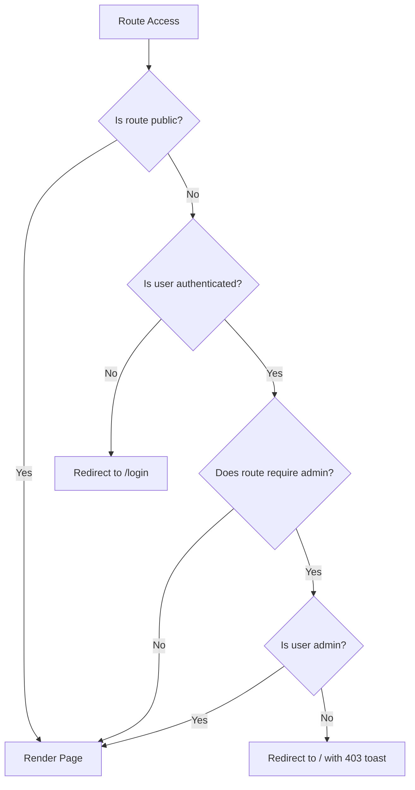
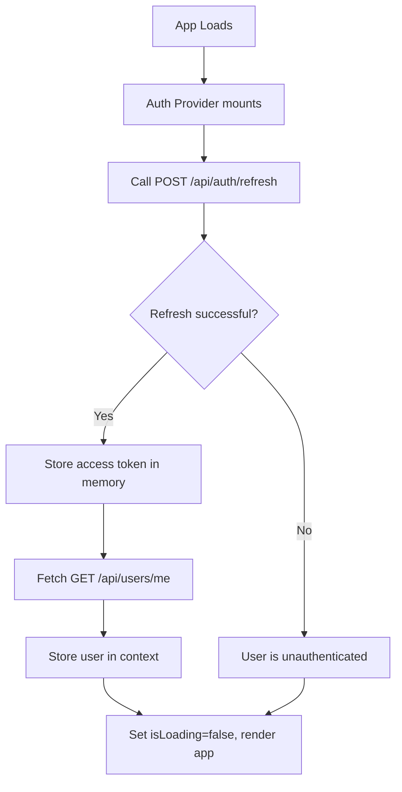

# 07 — FRONTEND ARCHITECTURE

## Technology Stack

| Concern | Technology | Classification | Why |
|---------|-----------|---------------|-----|
| Framework | React 18+ | 🔴 REQUIRED | MERN stack |
| Language | TypeScript | 🟡 RECOMMENDED | Type safety, better DX, explainable in interview |
| Build Tool | Vite | 🟡 RECOMMENDED | Fast HMR, native TS/JSX support, modern |
| Routing | React Router v6 | 🟡 RECOMMENDED | Industry standard, nested routes, loaders |
| Server State | TanStack Query v5 | 🟡 RECOMMENDED | Caching, refetching, optimistic updates, pagination |
| Client State | React Context + useState/useReducer | 🟡 RECOMMENDED | Lightweight, no extra dependency for simple state |
| HTTP Client | Axios | 🟡 RECOMMENDED | Interceptors for token refresh, request/response transforms |
| UI Primitives | Coss UI | 🔴 REQUIRED | Assessment-mandated |
| Styling | Tailwind CSS v4 | 🔴 REQUIRED | Coss UI built on Tailwind |
| Forms | React Hook Form + zod | 🟡 RECOMMENDED | Performant forms, shared validation schemas |
| Markdown | react-markdown + rehype-sanitize | 🟡 RECOMMENDED | Render user Markdown safely |
| Icons | Lucide React | 🟡 RECOMMENDED | Coss UI uses Lucide icons internally |

---

## Application Routes

### Route Structure

| Route | Page | Auth | Role | Classification |
|-------|------|------|------|---------------|
| `/` | Landing / Feature Feed | Public | — | 🔴 REQUIRED |
| `/roadmap` | Public Kanban Roadmap | Public | — | 🔴 REQUIRED |
| `/posts/:id` | Feature Request Detail | Public | — | 🔴 REQUIRED |
| `/login` | Login Page | Guest only | — | 🔴 REQUIRED |
| `/signup` | Signup Page | Guest only | — | 🔴 REQUIRED |
| `/verify-email` | Email Verification | Guest only | — | 🔴 REQUIRED |
| `/forgot-password` | Forgot Password | Guest only | — | 🔴 REQUIRED |
| `/reset-password` | Reset Password | Guest only | — | 🔴 REQUIRED |
| `/dashboard` | User Dashboard | Protected | user | 🟡 RECOMMENDED |
| `/my-requests` | My Feature Requests | Protected | user | 🟡 RECOMMENDED |
| `/admin` | Admin Dashboard | Protected | admin | 🔴 REQUIRED |
| `/admin/posts` | Admin Request Management | Protected | admin | 🔴 REQUIRED |
| `*` | 404 Not Found | Public | — | 🟡 RECOMMENDED |

### Route Guards



**Route guard components:**
- `<PublicRoute>` — Accessible to everyone
- `<GuestRoute>` — Only for unauthenticated users (login, signup). Redirect authenticated users to `/`.
- `<ProtectedRoute>` — Only for authenticated users. Redirect to `/login`.
- `<AdminRoute>` — Only for admin users. Redirect non-admins to `/`.

---

## Auth State Management

### Auth Context

The auth context manages:
- `user` — Current user object or null
- `accessToken` — JWT string in memory (never localStorage)
- `isAuthenticated` — Derived: `!!user`
- `isLoading` — True while checking auth status on app load
- `login(email, password)` — Login function
- `signup(data)` — Signup function
- `logout()` — Logout function

### App Initialization Flow



This pattern means:
- On page refresh, access token is lost (in-memory only)
- The app silently tries to refresh using the httpOnly cookie
- If refresh succeeds → user stays logged in
- If refresh fails → user must log in again

---

## Server State Management (TanStack Query)

### Why TanStack Query
- **Caching:** Avoid redundant API calls
- **Background refetching:** Keep data fresh
- **Optimistic updates:** Required for voting
- **Pagination support:** Built-in
- **Loading/error states:** Automatic

### Key Query Keys

```
['posts', { page, sort, category, status, search }]  // Post feed
['posts', postId]                                      // Single post
['posts', postId, 'comments']                          // Post comments
['roadmap']                                            // Roadmap data
['user', 'me']                                         // Current user
['admin', 'posts', filters]                            // Admin post list
```

### Optimistic Voting Pattern

```
// Pseudocode for optimistic vote mutation
const voteMutation = useMutation({
  mutationFn: (postId) => api.post(`/posts/${postId}/vote`),
  onMutate: async (postId) => {
    // Cancel outgoing refetches
    await queryClient.cancelQueries(['posts']);
    
    // Snapshot previous state
    const previousPosts = queryClient.getQueryData(['posts', ...]);
    
    // Optimistically update
    queryClient.setQueryData(['posts', ...], (old) => ({
      ...old,
      posts: old.posts.map(p => 
        p._id === postId 
          ? { ...p, hasVoted: !p.hasVoted, voteCount: p.hasVoted ? p.voteCount - 1 : p.voteCount + 1 }
          : p
      )
    }));
    
    return { previousPosts };
  },
  onError: (err, postId, context) => {
    // Rollback on error
    queryClient.setQueryData(['posts', ...], context.previousPosts);
    toast.error('Vote failed. Please try again.');
  },
  onSettled: () => {
    // Refetch to ensure server state
    queryClient.invalidateQueries(['posts']);
  }
});
```

---

## Axios Configuration

### Interceptor Setup

**Request interceptor:**
- Attach access token from auth context as `Authorization: Bearer <token>` header

**Response interceptor:**
- On 401 response → attempt token refresh
- On successful refresh → retry original request with new token
- On refresh failure → clear auth state, redirect to login
- Queue concurrent requests during refresh (prevent multiple refresh calls)

---

## Page Structure

### Landing / Feature Feed (`/`)
```
┌─────────────────────────────────┐
│ Navbar (Logo, Nav, Auth buttons)│
├─────────────────────────────────┤
│ Hero Section (optional)         │
├───────────────┬─────────────────┤
│ Sidebar       │ Feed Content    │
│ - Categories  │ - Search bar    │
│ - Status      │ - Sort controls │
│ - Filters     │ - Post cards    │
│               │ - Pagination    │
└───────────────┴─────────────────┘
```

### Feature Request Detail (`/posts/:id`)
```
┌─────────────────────────────────┐
│ Navbar                          │
├─────────────────────────────────┤
│ Back button                     │
├─────────────────────────────────┤
│ Post Header (title, status,     │
│  author, date, categories)      │
├───────────────┬─────────────────┤
│ Description   │ Vote Section    │
│ (Markdown)    │ (count + button)│
├───────────────┴─────────────────┤
│ Comments Section                │
│ - Comment form                  │
│ - Threaded comments             │
└─────────────────────────────────┘
```

### Public Roadmap (`/roadmap`)
```
┌─────────────────────────────────┐
│ Navbar                          │
├─────────────────────────────────┤
│ Roadmap Header                  │
├──────────┬──────────┬───────────┤
│ Planned  │In Progress│ Completed│
│ ┌──────┐ │ ┌──────┐ │ ┌──────┐ │
│ │Card  │ │ │Card  │ │ │Card  │ │
│ └──────┘ │ └──────┘ │ └──────┘ │
│ ┌──────┐ │          │ ┌──────┐ │
│ │Card  │ │          │ │Card  │ │
│ └──────┘ │          │ └──────┘ │
└──────────┴──────────┴───────────┘
```

### Admin Dashboard (`/admin`)
```
┌─────────────────────────────────┐
│ Navbar + Admin indicator        │
├──────────┬──────────────────────┤
│ Sidebar  │ Content Area         │
│ - Posts  │ - Stats cards        │
│ - Users  │ - Request table      │
│          │ - Status management  │
│          │ - Filters            │
└──────────┴──────────────────────┘
```

---

## Reusable Components

### Layout Components
- `<Navbar />` — Top navigation with auth state awareness
- `<Sidebar />` — Filter sidebar for feed
- `<PageLayout />` — Consistent page wrapper with max-width
- `<AdminLayout />` — Admin-specific layout with side nav

### Feature Components
- `<PostCard />` — Feature request card in feed
- `<PostForm />` — Create/edit feature request modal form
- `<VoteButton />` — Upvote button with count and optimistic UI
- `<StatusBadge />` — Color-coded status indicator
- `<CategoryTag />` — Category pill/badge
- `<RoadmapColumn />` — Single Kanban column
- `<RoadmapCard />` — Card within Kanban column

### Comment Components
- `<CommentForm />` — New comment / reply textarea
- `<CommentThread />` — Threaded comment display
- `<CommentItem />` — Single comment with actions

### Auth Components
- `<AuthModal />` — Login/signup modal (triggered by unauthenticated vote)
- `<LoginForm />` — Login form
- `<SignupForm />` — Registration form

### Shared Components (composed from Coss UI)
- `<SearchInput />` — Debounced search with icon
- `<SortSelect />` — Sort option dropdown
- `<FilterGroup />` — Filter checkbox/button group
- `<Pagination />` — Page navigation
- `<EmptyState />` — No content placeholder
- `<LoadingSkeleton />` — Content loading placeholder
- `<MarkdownRenderer />` — Safe Markdown display
- `<ConfirmDialog />` — Destructive action confirmation

---

## Form Strategy

- **Library:** React Hook Form for form state and validation
- **Validation:** Zod schemas, shared with backend where possible
- **Submission:** Async submit via TanStack Query mutations
- **UX:** Inline field-level error messages, submit button loading state, success toast on completion

---

## Responsive Strategy 🔴 REQUIRED

| Breakpoint | Layout |
|-----------|--------|
| Mobile (<640px) | Single column, bottom nav or hamburger, stacked Kanban |
| Tablet (640–1024px) | Two columns where appropriate, sidebar collapses |
| Desktop (>1024px) | Full layout with sidebar, 3-column Kanban |

**Kanban on mobile:** Stack columns vertically with collapsible sections or tabs.

**Feed on mobile:** Full-width cards, filter/sort in dropdown or sheet.
