# 10 — DEVELOPMENT PHASES

## Phase Overview

```mermaid
gantt
    title Roadly Development Phases
    dateFormat X
    axisFormat %s

    section Foundation
    Phase 0 - Requirements           :done, p0, 0, 1
    Phase 1 - Project Setup          :p1, 1, 2

    section Core Backend
    Phase 2 - Auth & Security        :p2, 2, 4
    Phase 3 - DB & Backend Base      :p3, 4, 5

    section Features
    Phase 4 - Feature Requests       :p4, 5, 7
    Phase 5 - Voting System          :p5, 7, 8
    Phase 6 - Comments               :p6, 8, 10
    Phase 7 - RBAC & Admin           :p7, 10, 12
    Phase 8 - Public Roadmap         :p8, 12, 13

    section Polish
    Phase 9  - Search/Filter/Sort    :p9, 13, 14
    Phase 10 - UX Polish             :p10, 14, 16
    Phase 11 - Extra Features        :p11, 16, 17

    section Release
    Phase 12 - Testing & Review      :p12, 17, 19
    Phase 13 - Deployment            :p13, 19, 20
    Phase 14 - README & Docs         :p14, 20, 21
    Phase 15 - Demo Video            :p15, 21, 22
```



---

## Phase 0: Requirements & Architecture ✅ COMPLETED

**Goal:** Understand requirements, design the system, create documentation.

**Dependencies:** Assessment PDFs

**Tasks:**
- [x] Read Technical Assessment PDF
- [x] Read Project 01 PDF
- [x] Research Coss UI
- [x] Create all 20 documentation files
- [x] Create `.cursor/rules/project-rules.mdc`

**Acceptance Criteria:**
- All documentation files exist under `docs/`
- Every mandatory requirement is documented and traceable
- Architecture decisions are documented with rationale
- No implementation code has been written

**Definition of Done:** Documentation reviewed and approved by the developer.

---

## Phase 1: Repository & Project Setup

**Goal:** Initialize the monorepo, install dependencies, configure tooling, verify dev servers start.

**Dependencies:** Phase 0 (documentation approved)

**Tasks:**
- [ ] Initialize Git repository
- [ ] Create root `package.json` with workspace scripts
- [ ] Create `client/` with Vite + React + TypeScript (`npx create-vite`)
- [ ] Create `server/` with Node.js + Express + TypeScript
- [ ] Install and configure Coss UI (verify latest installation instructions)
- [ ] Configure Tailwind CSS v4
- [ ] Install shared dependencies (axios, react-router, tanstack-query, react-hook-form, zod)
- [ ] Install server dependencies (express, mongoose, jsonwebtoken, bcryptjs, cookie-parser, cors, helmet, dotenv)
- [ ] Configure ESLint + Prettier for both client and server
- [ ] Create `.env.example` files for client and server
- [ ] Create `.gitignore`
- [ ] Set up basic folder structure (empty directories with README placeholders)
- [ ] Verify `npm run dev` starts both client and server

**Files Expected to Change:**
```
package.json (root)
client/package.json, vite.config.ts, tsconfig.json, tailwind.config.ts, components.json
server/package.json, tsconfig.json, nodemon.json
.gitignore, .env.example
```

**Acceptance Criteria:**
- `cd client && npm run dev` starts Vite dev server on port 5173
- `cd server && npm run dev` starts Express server on port 5000
- Both compile without errors
- Coss UI components are installable/usable
- Linting runs without errors

**Testing:** Manual — verify dev servers start.

**Risks:**
- Coss UI installation process may have changed. Verify docs first.
- Tailwind CSS v4 configuration differences from v3.

**Definition of Done:** Both dev servers start, a test Coss UI `<Button>` renders on the client.

---

## Phase 2: Authentication & Security

**Goal:** Implement the complete authentication system (signup, login, refresh, logout, forgot/reset password, email verification simulation).

**Dependencies:** Phase 1

**Tasks:**
- [ ] Create User model with Mongoose schema
- [ ] Create RefreshToken model
- [ ] Implement password hashing (bcrypt pre-save hook)
- [ ] Implement JWT utility (sign/verify access + refresh tokens)
- [ ] Implement crypto token utility (verification + reset tokens)
- [ ] Implement email simulation utility (console logging)
- [ ] Create auth service (signup, login, refresh, logout, forgotPassword, resetPassword, verifyEmail)
- [ ] Create auth controller
- [ ] Create auth routes
- [ ] Implement `authenticate` middleware
- [ ] Implement `authorize` middleware
- [ ] Implement `errorHandler` middleware
- [ ] Implement `validate` middleware with validation schemas
- [ ] Configure CORS
- [ ] Configure cookie parser
- [ ] Implement rate limiting on auth routes
- [ ] Create AppError class
- [ ] Create catchAsync utility
- [ ] Create response formatting utility
- [ ] Create auth API client functions (client-side)
- [ ] Create AuthContext with login, signup, logout, refresh logic
- [ ] Create Axios interceptors (token attach, 401 retry with refresh)
- [ ] Create login page
- [ ] Create signup page
- [ ] Create forgot password page
- [ ] Create reset password page
- [ ] Create verify email page
- [ ] Create route guards (ProtectedRoute, GuestRoute, AdminRoute)
- [ ] Create Navbar with auth state (login/logout buttons)
- [ ] Create admin seed script

**Files Expected to Change:**
```
server/src/models/User.model.ts, RefreshToken.model.ts
server/src/services/auth.service.ts
server/src/controllers/auth.controller.ts
server/src/routes/auth.routes.ts
server/src/middleware/authenticate.ts, authorize.ts, errorHandler.ts, validate.ts, rateLimiter.ts
server/src/validators/auth.validator.ts
server/src/utils/AppError.ts, catchAsync.ts, token.ts, email.ts, response.ts
server/src/config/db.ts, env.ts, cors.ts
server/src/app.ts, server.ts
client/src/api/axios.ts, auth.api.ts
client/src/contexts/AuthContext.tsx
client/src/hooks/useAuth.ts
client/src/pages/LoginPage.tsx, SignupPage.tsx, ForgotPasswordPage.tsx, ResetPasswordPage.tsx, VerifyEmailPage.tsx
client/src/routes/AppRouter.tsx, ProtectedRoute.tsx, GuestRoute.tsx, AdminRoute.tsx
client/src/components/layout/Navbar.tsx
client/src/components/auth/LoginForm.tsx, SignupForm.tsx
```

**Acceptance Criteria:**
- User can sign up → see verification token in console → verify email
- User can log in → receive access token in memory + refresh cookie
- Protected routes redirect unauthenticated users to login
- Token refresh works silently on expiration
- Logout clears tokens and cookie
- Forgot/reset password flow works end-to-end
- Admin seed creates an admin user
- Rate limiting works on auth endpoints

**Testing:**
- Manual: All auth flows
- API tests: Each auth endpoint (happy + error paths)
- Security: Verify tokens not in localStorage, cookie flags correct

**Risks:**
- Cookie configuration issues across different browsers
- Axios interceptor race conditions during concurrent requests

**Definition of Done:** All 7 auth features work end-to-end. Auth middleware protects routes.

---

## Phase 3: Database & Backend Foundation

**Goal:** Set up database connection, remaining models, and shared backend infrastructure.

**Dependencies:** Phase 2 (User model already created)

**Tasks:**
- [ ] Create Post model with indexes (text index, compound indexes)
- [ ] Create Comment model with indexes
- [ ] Verify MongoDB connection and index creation
- [ ] Test model validation rules
- [ ] Ensure centralized error handling works for all error types
- [ ] Create response format helpers for pagination

**Files Expected to Change:**
```
server/src/models/Post.model.ts, Comment.model.ts
server/src/utils/response.ts (pagination helpers)
```

**Acceptance Criteria:**
- All models create collections with correct indexes in MongoDB
- Model validations reject invalid data
- Text index enables `$text` search

**Testing:** Unit tests for model validation. Manual MongoDB inspection.

**Definition of Done:** All collections exist with correct schemas and indexes.

---

## Phase 4: Feature Request Engine

**Goal:** Implement CRUD for feature requests with feed, pagination, and the submission modal.

**Dependencies:** Phase 3

**Tasks:**
- [ ] Create post service (create, getAll, getById, update, delete)
- [ ] Create post controller
- [ ] Create post routes (with auth + validation middleware)
- [ ] Create post validation schemas
- [ ] Implement pagination logic (offset-based)
- [ ] Create API client functions for posts
- [ ] Create PostCard component
- [ ] Create PostForm component (modal)
- [ ] Create PostList component
- [ ] Create StatusBadge component
- [ ] Create CategoryTag component
- [ ] Create HomePage with feed
- [ ] Create PostDetailPage (basic — full detail in Phase 6 with comments)
- [ ] Create Pagination component
- [ ] Create EmptyState component
- [ ] Create LoadingSkeleton component
- [ ] Create custom hooks (usePosts)
- [ ] Implement feed with loading/empty/error states

**Files Expected to Change:**
```
server/src/services/post.service.ts
server/src/controllers/post.controller.ts
server/src/routes/post.routes.ts
server/src/validators/post.validator.ts
client/src/api/posts.api.ts
client/src/hooks/usePosts.ts
client/src/pages/HomePage.tsx, PostDetailPage.tsx
client/src/components/posts/PostCard.tsx, PostForm.tsx, PostList.tsx, StatusBadge.tsx, CategoryTag.tsx, SortSelect.tsx
client/src/components/shared/Pagination.tsx, EmptyState.tsx, LoadingSkeleton.tsx
```

**Acceptance Criteria:**
- Authenticated users can submit feature requests via modal
- Feed displays posts with correct info (title, author, status, vote count, comment count)
- Pagination works
- Post detail page shows full content

**Testing:** Manual: Create, view, paginate. API tests for CRUD endpoints.

**Definition of Done:** Users can submit and browse feature requests.

---

## Phase 5: Voting System

**Goal:** Implement atomic upvoting with optimistic UI, rollback, and unauthenticated user handling.

**Dependencies:** Phase 4

**Tasks:**
- [ ] Create vote endpoint in post routes
- [ ] Implement atomic vote logic in post service ($addToSet/$pull/$inc)
- [ ] Create VoteButton component with optimistic UI
- [ ] Implement optimistic update + rollback in useVote hook
- [ ] Implement AuthModal for unauthenticated vote attempt
- [ ] Add hasVoted field computation to post queries
- [ ] Test duplicate vote prevention
- [ ] Test rollback on network failure

**Files Expected to Change:**
```
server/src/services/post.service.ts (vote method)
server/src/controllers/post.controller.ts (vote handler)
server/src/routes/post.routes.ts (vote route)
client/src/hooks/useVote.ts
client/src/components/posts/VoteButton.tsx
client/src/components/auth/AuthModal.tsx
```

**Acceptance Criteria:**
- Clicking vote instantly updates UI (optimistic)
- Second click removes vote (toggle behavior)
- Duplicate votes are impossible at the database level
- Network failure rolls back the UI and shows error toast
- Unauthenticated click shows login/signup modal
- Vote count is accurate after all operations

**Testing:** Critical — test concurrent votes, duplicate attempts, rollback scenarios.

**Risks:** Race conditions on concurrent votes (mitigated by atomic MongoDB ops).

**Definition of Done:** Voting works atomically with proper optimistic UI and rollback.

---

## Phase 6: Comments & Discussions

**Goal:** Implement threaded comments with Markdown support and permission-based edit/delete.

**Dependencies:** Phase 4

**Tasks:**
- [ ] Create comment service (create, getByPost, update, delete)
- [ ] Create comment controller
- [ ] Create comment routes (with auth + validation)
- [ ] Create comment validation schemas
- [ ] Implement comment count maintenance (increment/decrement on Post)
- [ ] Create CommentThread component
- [ ] Create CommentItem component (with edit/delete actions)
- [ ] Create CommentForm component
- [ ] Create MarkdownRenderer component (react-markdown + rehype-sanitize)
- [ ] Implement thread nesting (adjacency list → tree structure)
- [ ] Add comment section to PostDetailPage
- [ ] Implement edit/delete permissions (author + admin)
- [ ] Create useComments hook

**Files Expected to Change:**
```
server/src/services/comment.service.ts
server/src/controllers/comment.controller.ts
server/src/routes/comment.routes.ts
server/src/validators/comment.validator.ts
client/src/api/comments.api.ts
client/src/hooks/useComments.ts
client/src/components/comments/CommentThread.tsx, CommentItem.tsx, CommentForm.tsx
client/src/components/shared/MarkdownRenderer.tsx
client/src/pages/PostDetailPage.tsx (update)
```

**Acceptance Criteria:**
- Users can add top-level comments
- Users can reply to comments (1 level deep)
- Comments render Markdown safely
- Authors can edit/delete their own comments
- Admins can edit/delete any comment
- Comment count updates on post when comments are added/deleted
- "(edited)" indicator shows for edited comments

**Testing:** Permission tests (author edit, admin delete, unauthorized attempt). Markdown XSS test.

**Definition of Done:** Threaded comments work with proper Markdown and permissions.

---

## Phase 7: RBAC & Admin

**Goal:** Implement admin panel with request management and status transitions.

**Dependencies:** Phase 2 (auth), Phase 4 (posts), Phase 5 (voting), Phase 6 (comments)

**Tasks:**
- [ ] Create admin service (getAllPosts with filters, updateStatus, deletePost)
- [ ] Create admin controller
- [ ] Create admin routes (with admin authorization)
- [ ] Create AdminLayout component
- [ ] Create AdminDashboard page (stats overview)
- [ ] Create AdminPostsPage (table view with actions)
- [ ] Implement status transition dropdown/buttons
- [ ] Add admin navigation to Navbar (conditional on role)
- [ ] Create admin API functions
- [ ] Create useAdmin hook

**Files Expected to Change:**
```
server/src/services/admin.service.ts
server/src/controllers/admin.controller.ts
server/src/routes/admin.routes.ts
client/src/api/admin.api.ts
client/src/hooks/useAdmin.ts
client/src/pages/admin/AdminDashboard.tsx, AdminPostsPage.tsx
client/src/components/layout/AdminLayout.tsx, Navbar.tsx (update)
```

**Acceptance Criteria:**
- Admin can view all posts in a management table
- Admin can change post status (Under Review → Planned → In Progress → Completed)
- Admin can delete any post
- Non-admin users cannot access admin routes (API returns 403)
- Admin panel shows basic stats (total posts, posts per status)

**Testing:** Authorization tests — verify non-admin API access is rejected.

**Definition of Done:** Admin panel fully functional with RBAC enforcement.

---

## Phase 8: Public Roadmap / Kanban

**Goal:** Implement the public 3-column Kanban roadmap view.

**Dependencies:** Phase 7 (status management must work)

**Tasks:**
- [ ] Create roadmap service (get posts grouped by status)
- [ ] Create roadmap controller
- [ ] Create roadmap routes
- [ ] Create RoadmapBoard component (3-column layout)
- [ ] Create RoadmapColumn component
- [ ] Create RoadmapCard component
- [ ] Create RoadmapPage
- [ ] Create roadmap API client function
- [ ] Create useRoadmap hook
- [ ] Implement responsive roadmap (tabs/stack on mobile)
- [ ] Add roadmap link to navigation

**Files Expected to Change:**
```
server/src/services/roadmap.service.ts
server/src/controllers/roadmap.controller.ts
server/src/routes/roadmap.routes.ts
client/src/api/roadmap.api.ts
client/src/hooks/useRoadmap.ts
client/src/pages/RoadmapPage.tsx
client/src/components/roadmap/RoadmapBoard.tsx, RoadmapColumn.tsx, RoadmapCard.tsx
client/src/components/layout/Navbar.tsx (update)
```

**Acceptance Criteria:**
- Public roadmap shows 3 columns: Planned, In Progress, Completed
- Roadmap cards show title, category, vote count
- Roadmap updates when admin changes post status (on page refresh/refocus)
- Roadmap is accessible without authentication
- Responsive layout works on mobile (stacked or tabbed)

**Testing:** Manual — verify column grouping, responsive behavior.

**Definition of Done:** Public Kanban roadmap displays and updates correctly.

---

## Phase 9: Search, Filter & Sort

**Goal:** Implement debounced search, category/status filtering, and sorting across the feed.

**Dependencies:** Phase 4, Phase 3 (text index)

**Tasks:**
- [ ] Implement server-side search using MongoDB text index
- [ ] Implement server-side filtering (category, status query params)
- [ ] Implement server-side sorting (newest, most-voted, most-discussed)
- [ ] Create SearchInput component with debounce
- [ ] Create FilterGroup component (category + status checkboxes)
- [ ] Create SortSelect component
- [ ] Update feed page to use search/filter/sort
- [ ] Create useDebounce hook
- [ ] Implement URL query parameter sync (filters in URL) — 🟡 RECOMMENDED

**Files Expected to Change:**
```
server/src/services/post.service.ts (update getAll with search/filter/sort)
client/src/components/shared/SearchInput.tsx, FilterGroup.tsx
client/src/components/posts/SortSelect.tsx
client/src/hooks/useDebounce.ts, usePosts.ts (update)
client/src/pages/HomePage.tsx (update)
```

**Acceptance Criteria:**
- Search finds posts by title and description (debounced, 300ms)
- Filters narrow results by category and/or status
- Sorting changes order (newest, most voted, most discussed)
- Filters and search combine correctly
- URL reflects current search/filter/sort state

**Testing:** Search with various queries. Filter combinations. Sort verification.

**Definition of Done:** Search, filter, and sort work together on the feed.

---

## Phase 10: Premium Frontend & UX Polish

**Goal:** Make the application look and feel like a polished SaaS product.

**Dependencies:** All feature phases (4–9)

**Tasks:**
- [ ] Refine all page layouts for consistency
- [ ] Add proper loading skeletons to all data-fetching pages
- [ ] Add empty states to all list views
- [ ] Add error states with retry functionality
- [ ] Configure toast notifications for all user actions
- [ ] Ensure all forms have proper validation UX (inline errors, loading buttons)
- [ ] Add 404 page
- [ ] Responsive audit — test all pages at mobile, tablet, desktop widths
- [ ] Spacing and typography audit
- [ ] Keyboard navigation testing
- [ ] Add subtle transitions/animations (page transitions, hover states)
- [ ] Implement dark/light theme toggle (🔵 OPTIONAL but recommended)
- [ ] Landing page refinement (hero section, CTA)

**Acceptance Criteria:**
- No page renders without a loading state during data fetch
- No list view shows a blank area when empty
- All user actions show appropriate feedback (toast)
- Responsive design works on common screen sizes
- Visual consistency across all pages

**Testing:** Manual QA checklist. Cross-browser testing.

**Definition of Done:** The app looks like a professional SaaS product.

---

## Phase 11: Approved Extra Features

**Goal:** Implement selected optional features that are approved and time-permitting.

**Dependencies:** Phase 10 (core must be polished first)

**Tasks:** Depends on which extras are approved. See [16-EXTRA-FEATURES.md](file:///c:/Users/MOBILE/Desktop/com.bot%20project/docs/16-EXTRA-FEATURES.md).

**Acceptance Criteria:** Each extra feature works without breaking existing functionality.

**Risks:** Extras must not destabilize core features.

**Definition of Done:** Approved extras are implemented and tested.

---

## Phase 12: Testing, Security & Performance Review

**Goal:** Comprehensive testing and security audit.

**Dependencies:** All implementation phases

**Tasks:**
- [ ] Write/run API integration tests for auth endpoints
- [ ] Write/run API tests for post CRUD + voting
- [ ] Write/run API tests for comments
- [ ] Write/run authorization tests (role-based access)
- [ ] Security audit: token storage, cookie flags, input validation, XSS, CSRF
- [ ] Performance check: query efficiency, N+1 queries, unnecessary re-renders
- [ ] Manual QA: Full user journey testing
- [ ] Fix any bugs found

**Testing:** Automated test suite + manual QA checklist.

**Definition of Done:** All critical flows tested, security audit passed, no P0 bugs.

---

## Phase 13: Deployment

**Goal:** Deploy the application to production hosting.

**Dependencies:** Phase 12

**Tasks:**
- [ ] Set up MongoDB Atlas (or chosen host)
- [ ] Set up backend deployment (Render, Railway, or chosen platform)
- [ ] Set up frontend deployment (Vercel, Netlify, or chosen platform)
- [ ] Configure production environment variables
- [ ] Configure production CORS, cookie settings
- [ ] Verify deployment works end-to-end
- [ ] Set up health check endpoint

**Definition of Done:** Application accessible via public URL, all features working.

---

## Phase 14: README & Documentation

**Goal:** Create a comprehensive README and finalize documentation.

**Dependencies:** Phase 13

**Tasks:**
- [ ] Write README.md following plan in [14-README-PLAN.md](file:///c:/Users/MOBILE/Desktop/com.bot%20project/docs/14-README-PLAN.md)
- [ ] Add screenshots/GIFs
- [ ] Finalize API documentation
- [ ] Ensure `.env.example` files are complete
- [ ] Review all doc files for accuracy after implementation
- [ ] Add any third-party library credits

**Definition of Done:** README is complete, professional, and contains all required information.

---

## Phase 15: Demo Video & Final Assessment Preparation

**Goal:** Record the project explanation video and submit.

**Dependencies:** Phase 14

**Tasks:**
- [ ] Prepare demo script following [15-DEMO-VIDEO-PLAN.md](file:///c:/Users/MOBILE/Desktop/com.bot%20project/docs/15-DEMO-VIDEO-PLAN.md)
- [ ] Record video covering all required topics
- [ ] Upload video to public platform
- [ ] Final review of submission checklist
- [ ] Submit via assessment form

**Definition of Done:** Video uploaded, Git repo public, assessment form submitted.
