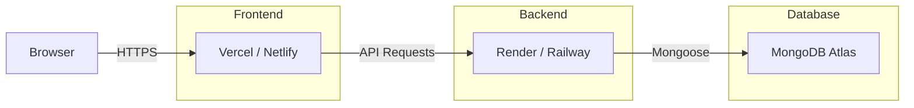

# 13 — DEPLOYMENT

## Deployment Architecture



---

## Service Selection

### Frontend Hosting 🟡 RECOMMENDED

| Option | Pros | Cons | Recommendation |
|--------|------|------|---------------|
| **Vercel** | Free tier, automatic deploys from Git, optimized for React/Vite, preview deploys | Cold starts minimal | ✅ RECOMMENDED |
| **Netlify** | Free tier, easy setup, form handling | Slightly less optimized for SPA routing | ✅ Alternative |
| **Render** | Static site hosting available | Better suited for backend | ❌ Not preferred |

**Selected: Vercel** — Best free-tier experience for Vite/React apps. Automatic HTTPS, preview deploys, zero-config.

### Backend Hosting 🟡 RECOMMENDED

| Option | Pros | Cons | Recommendation |
|--------|------|------|---------------|
| **Render** | Free tier (with limitations), Docker support, auto-deploy from Git, easy env vars | Free tier spins down after inactivity (cold starts) | ✅ RECOMMENDED |
| **Railway** | Generous free tier, easy setup, PostgreSQL/MongoDB add-ons | Credit-based free tier | ✅ Alternative |
| **Fly.io** | Global edge, Docker | More complex setup | ❌ Overkill for assessment |

**Selected: Render** — Simple setup, free tier sufficient for assessment, supports Node.js natively.

> [!WARNING]
> Render's free tier spins down after 15 minutes of inactivity. First request after spin-down takes ~30 seconds. This is acceptable for an assessment project. Mention this limitation in README.

### Database Hosting 🟡 RECOMMENDED

| Option | Pros | Cons | Recommendation |
|--------|------|------|---------------|
| **MongoDB Atlas** | Free M0 cluster (512MB), managed, backups, Atlas Search | 512MB limit on free tier | ✅ RECOMMENDED |
| **Self-hosted** | Full control | Requires server management | ❌ Not practical |

**Selected: MongoDB Atlas** — Free M0 cluster is sufficient. Mongoose connects with a connection string.

---

## Environment Variables

### Server (.env)

```env
# Application
NODE_ENV=production
PORT=5000

# Database
MONGODB_URI=mongodb+srv://<user>:<password>@<cluster>.mongodb.net/roadly?retryWrites=true&w=majority

# JWT Secrets (generate unique random strings)
JWT_ACCESS_SECRET=<random-64-char-string>
JWT_REFRESH_SECRET=<different-random-64-char-string>
JWT_ACCESS_EXPIRY=15m
JWT_REFRESH_EXPIRY=7d

# Client
CLIENT_URL=https://roadly.vercel.app

# Rate Limiting (optional)
RATE_LIMIT_WINDOW_MS=900000
RATE_LIMIT_MAX=100
```

### Client (.env)

```env
VITE_API_URL=https://roadly-api.onrender.com/api
```

> [!CAUTION]
> The `.env` file is NEVER committed to Git. Use `.env.example` with placeholder values.

---

## Production Configuration Changes

### Cookie Settings (Production)

```javascript
{
  httpOnly: true,
  secure: true,           // HTTPS only
  sameSite: 'none',       // Cross-origin (different domains for frontend/backend)
  path: '/api/auth',
  maxAge: 7 * 24 * 60 * 60 * 1000,
  domain: '.onrender.com' // or omit for same-site
}
```

> [!IMPORTANT]
> If frontend (Vercel) and backend (Render) are on different domains, `sameSite` must be `'none'` (not `'strict'`), and `secure` must be `true`. This requires HTTPS on both sides.

🟠 IMPLEMENTATION DECISION: If this causes issues, consider:
- Proxying API through Vercel rewrites (same origin)
- Deploying frontend and backend on the same domain (e.g., both on Render)

### CORS (Production)

```javascript
{
  origin: process.env.CLIENT_URL, // e.g., 'https://roadly.vercel.app'
  credentials: true,
  methods: ['GET', 'POST', 'PUT', 'PATCH', 'DELETE'],
  allowedHeaders: ['Content-Type', 'Authorization']
}
```

---

## Build Process

### Client Build

```bash
cd client
npm run build     # Vite produces dist/ directory
```

Vercel handles this automatically on push.

### Server Build (if using TypeScript)

```bash
cd server
npm run build     # Compile TypeScript to dist/
npm start         # Run compiled JavaScript
```

**`package.json` scripts:**
```json
{
  "scripts": {
    "dev": "tsx watch src/server.ts",
    "build": "tsc",
    "start": "node dist/server.js",
    "seed:admin": "tsx src/seeds/admin.seed.ts"
  }
}
```

---

## Deployment Checklist

### Pre-Deployment

- [ ] All features working locally
- [ ] All critical tests passing
- [ ] `.env.example` files updated
- [ ] No secrets in source code (`git grep -i "password\|secret\|key"`)
- [ ] `.gitignore` includes `.env`, `node_modules`, `dist`
- [ ] README has setup instructions

### Database Setup

- [ ] MongoDB Atlas account created
- [ ] M0 free cluster created
- [ ] Database user created with read/write access
- [ ] Network access configured (allow from deployment IPs or 0.0.0.0/0 for assessment)
- [ ] Connection string obtained
- [ ] Indexes verified on Atlas

### Backend Deployment (Render)

- [ ] Render account created
- [ ] New Web Service created
- [ ] Connected to Git repository
- [ ] Build command: `cd server && npm install && npm run build`
- [ ] Start command: `cd server && npm start`
- [ ] Environment variables set
- [ ] Health check endpoint configured
- [ ] Deploy successful — API responds on `/api/health`

### Frontend Deployment (Vercel)

- [ ] Vercel account created
- [ ] Import from Git repository
- [ ] Root directory set to `client/`
- [ ] Build command: `npm run build`
- [ ] Output directory: `dist`
- [ ] Environment variables set (`VITE_API_URL`)
- [ ] Deploy successful — app loads in browser

### Post-Deployment Verification

- [ ] Frontend loads without errors
- [ ] API health check returns 200
- [ ] Signup flow works
- [ ] Login flow works (tokens + cookies)
- [ ] Feature request creation works
- [ ] Voting works
- [ ] Comments work
- [ ] Roadmap displays correctly
- [ ] Admin panel accessible
- [ ] Search works
- [ ] CORS configured correctly (no blocked requests)
- [ ] Cookies set correctly (check DevTools)

---

## Health Check Endpoint 🟡 RECOMMENDED

```
GET /api/health

Response: 200 OK
{
  "success": true,
  "data": {
    "status": "healthy",
    "environment": "production",
    "timestamp": "2026-09-16T00:00:00.000Z",
    "uptime": 12345
  }
}
```

Use this for Render's health check configuration and monitoring.

---

## Logging in Production 🟡 RECOMMENDED

- Remove all `console.log` debug statements
- Keep `console.error` for unexpected errors
- Use `morgan('combined')` for HTTP request logging
- 🔵 OPTIONAL: Use `winston` or `pino` for structured logging

---

## Known Limitations

| Limitation | Impact | Mitigation |
|------------|--------|------------|
| Render free tier cold starts | ~30s first load after inactivity | Mention in README |
| MongoDB Atlas M0 (512MB) | Storage limit | Sufficient for assessment |
| No custom domain | URLs are `*.vercel.app` / `*.onrender.com` | Acceptable for assessment |
| No CI/CD pipeline | Manual deploys via Git push | Auto-deploy on push configured |
| No monitoring | No error tracking or APM | Acceptable for assessment |
