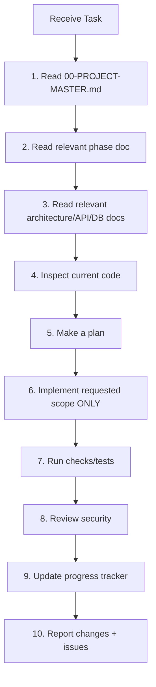

# 19 — AI AGENT WORKFLOW

## Purpose

This document defines the mandatory workflow for any AI coding agent working on the Roadly project. Following this workflow ensures consistency, prevents destructive changes, and maintains documentation alignment.

---

## Pre-Task Checklist (Before Every Task)



### Step 1: Read 00-PROJECT-MASTER.md
- Understand the project overview, classification labels, and open decisions
- Check if anything has changed since last read

### Step 2: Read the Relevant Phase Document
- Open `10-DEVELOPMENT-PHASES.md`
- Find the current phase and task
- Understand the acceptance criteria and definition of done

### Step 3: Read Relevant Architecture Documents
- If working on backend: Read `03-ARCHITECTURE.md`, `04-DATABASE-DESIGN.md`, `05-API-SPECIFICATION.md`
- If working on auth: Read `06-AUTH-SECURITY.md`
- If working on frontend: Read `07-FRONTEND-ARCHITECTURE.md`, `08-UI-DESIGN-SYSTEM.md`
- If working on any component: Read `09-FOLDER-STRUCTURE.md`

### Step 4: Inspect Current Code
- Look at the files you'll be modifying
- Check their imports and dependents
- Understand existing patterns before introducing new ones

### Step 5: Make a Plan
- For non-trivial changes, outline what you'll do:
  - What files to create/modify
  - What patterns to follow
  - What tests to write/run

### Step 6: Implement Only Requested Scope
- Do exactly what the task asks
- Do not add unrequested features
- Do not refactor unrelated code
- Do not "improve" things not in scope

### Step 7: Run Checks/Tests
- `npm run lint` — fix any lint errors
- `npm run typecheck` — fix any type errors
- Run relevant test files
- Manually verify the feature works

### Step 8: Review Security
For any auth/security-related changes:
- Verify tokens stored correctly
- Verify cookies configured correctly
- Verify authorization enforced at API level
- Verify input validated and sanitized

### Step 9: Update Progress Tracker
- Mark completed tasks as `COMPLETED` in `18-PROGRESS-TRACKER.md`
- Mark in-progress tasks as `IN PROGRESS`
- Note any blockers

### Step 10: Report
Provide a summary:
- Files created/modified
- Features implemented
- Decisions made (add to `17-DECISION-LOG.md` if significant)
- Assumptions
- Unresolved issues
- Test results

---

## Agent Prohibitions

| # | Rule | Consequence of Violation |
|---|------|------------------------|
| 1 | Do NOT rebuild from scratch | Existing work is lost |
| 2 | Do NOT overwrite working architecture | System breaks |
| 3 | Do NOT introduce dependencies without justification | Bloat, supply chain risk |
| 4 | Do NOT modify unrelated files | Unexpected side effects |
| 5 | Do NOT silently change requirements | Misalignment with assessment |
| 6 | Do NOT mark incomplete work as completed | False confidence |
| 7 | Do NOT hardcode secrets or tokens | Security vulnerability |
| 8 | Do NOT put tokens in localStorage | Assessment violation |
| 9 | Do NOT skip validation | Input injection risk |
| 10 | Do NOT put business logic in routes/controllers | Architecture violation |

---

## Decision-Making Authority

| Decision Type | Agent Can Decide | Needs Documentation | Needs Approval |
|--------------|:---:|:---:|:---:|
| Variable naming | ✅ | ❌ | ❌ |
| Function decomposition | ✅ | ❌ | ❌ |
| Error message wording | ✅ | ❌ | ❌ |
| Implementation approach within documented spec | ✅ | ✅ | ❌ |
| New utility function | ✅ | ✅ | ❌ |
| New dependency | ⚠️ | ✅ | ✅ |
| Schema change | ⚠️ | ✅ | ✅ |
| API endpoint change | ⚠️ | ✅ | ✅ |
| Architecture change | ❌ | ✅ | ✅ |
| New feature not in docs | ❌ | ✅ | ✅ |
| Security approach change | ❌ | ✅ | ✅ |

---

## File Organization Rules

| When creating... | Put it in... | Follow pattern from... |
|-----------------|-------------|----------------------|
| React component | `client/src/components/{feature}/` | Existing components |
| Page component | `client/src/pages/` | Existing pages |
| Custom hook | `client/src/hooks/` | Existing hooks |
| API function | `client/src/api/` | Existing API files |
| Express route | `server/src/routes/` | Existing routes |
| Controller | `server/src/controllers/` | Existing controllers |
| Service | `server/src/services/` | Existing services |
| Model | `server/src/models/` | Existing models |
| Middleware | `server/src/middleware/` | Existing middleware |
| Validator | `server/src/middleware/validations/` | Existing validators |
| Utility | `server/src/utils/` | Existing utils |
| Types | `*/src/types/` | Existing types |
| Test | `server/tests/` | Existing tests |

---

## Code Pattern Conventions

### Backend Pattern
```
// 1. Route defines path + middleware + handler
router.post('/', authenticate, validate(createPostSchema), postController.create);

// 2. Controller parses request, calls service, sends response
const create = catchAsync(async (req, res) => {
  const post = await postService.create(req.body, req.user._id);
  res.status(201).json({ success: true, data: { post } });
});

// 3. Service contains business logic
const create = async (data, userId) => {
  const post = await Post.create({ ...data, author: userId });
  return post;
};
```

### Frontend Pattern
```
// 1. API function makes HTTP request
export const createPost = (data) => api.post('/posts', data);

// 2. Hook wraps query/mutation
export const useCreatePost = () => useMutation({
  mutationFn: createPost,
  onSuccess: () => queryClient.invalidateQueries(['posts']),
});

// 3. Component uses hook
const { mutate, isPending } = useCreatePost();
```

---

## Task Size Guidelines

| Task Size | Description | Max Duration |
|-----------|-------------|-------------|
| **Small** | Single file change, utility function, bug fix | 30 min |
| **Medium** | Feature endpoint (route + controller + service), component | 1–2 hours |
| **Large** | Full feature (backend + frontend + tests) | 3–5 hours |
| **XL** | Full phase implementation | 1–2 days |

If a task exceeds its estimated duration by 50%, stop and reassess. The approach may need to change.

---

## Conflict Resolution

If documentation conflicts with code:
1. Read the relevant doc carefully
2. Check `17-DECISION-LOG.md` for decisions that may explain the difference
3. If a genuine conflict exists, document it and ask for clarification
4. Do NOT silently resolve the conflict by overriding documentation

If two docs conflict with each other:
1. `01-REQUIREMENTS.md` takes precedence over all feature docs (it's traced to PDFs)
2. `05-API-SPECIFICATION.md` takes precedence for API design
3. `04-DATABASE-DESIGN.md` takes precedence for schema design
4. `06-AUTH-SECURITY.md` takes precedence for security decisions

---

## Quality Gates

Before a phase can be marked as complete:

- [ ] All P0 tasks in the phase are COMPLETED
- [ ] All P1 tasks are COMPLETED or have documented justification for deferral
- [ ] Tests pass (where applicable)
- [ ] No TypeScript errors
- [ ] No lint errors
- [ ] Security review passed (for auth/security phases)
- [ ] Progress tracker updated
- [ ] Any new decisions logged
